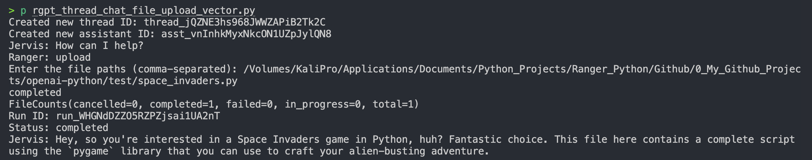

# Welcome to the OpenAI Python API library.

&nbsp;

<div align="center">
  <a href="https://github.com/openai/openai-python">
    
  </a>
  
  <a href="https://github.com/openai/openai-python/issues">
    
  </a>
  <a href="https://github.com/openai/openai-python/pulls">
    
  </a>
  <a href="https://github.com/openai/openai-python/discussions">
    
  </a>
  <a href="https://github.com/openai/openai-python/stargazers">
    
  </a>
  <a href="https://github.com/openai/openai-python/network/members">
    
  </a>
</div>
<br>

The [OpenAI](#quick-definitions) Python [library](#quick-definitions) provides convenient access to the OpenAI [REST API](#quick-definitions) from any [Python](#quick-definitions) 3.7+ application. The library includes type definitions for all request [params](#quick-definitions) and response fields, and offers both [synchronous](#quick-definitions) and [asynchronous](#quick-definitions) clients powered by [httpx](https://github.com/encode/httpx). It is generated from our [OpenAPI specification](https://github.com/openai/openai-openapi) with [Stainless](https://stainlessapi.com/).

The OpenAI Python library is like a toolbox that makes it easy to use [OpenAI Models](#OpenAI_Models) in your Python programs. Imagine you have a smart robot assistant that can help you with various tasks like answering questions or generating text. This library helps you communicate with that robot using a set of rules [API's](#quick-definitions) over the internet.

&nbsp;

<details id="table-of-contents" style="border: 4px solid #d1d5da; padding: 16px;">
<summary style="font-size: 2.5em; font-weight: bold;">Click for The Table of Contents</summary>

- [Documentation](#documentation)
- [Github Documentation](#github-documentation)
- [OpenAI Documentation](#openai-documentation)
- [Installation](#installation)
- [Usage](#usage)
- [Polling Helpers](#polling-helpers)
- [Bulk Upload Helpers](#bulk-upload-helpers)
- [Streaming Helpers](#streaming-helpers)
- [Async Usage](#async-usage)
- [Streaming Responses](#streaming-responses)
- [Module-Level Client](#module-level-client)
- [Using Types](#using-types)
- [Pagination](#pagination)
- [Nested Params](#nested-params)
- [File Uploads](#file-uploads)
- [Handling Errors](#handling-errors)
- [Retries](#retries)
- [Timeouts](#timeouts)
- [Advanced](#advanced)
- [Microsoft Azure OpenAI](#microsoft-azure-openai)
- [Requirements](#requirements)
- [Versioning](#versioning)
- [Quick Definitions](#quick-definitions)

</details>

<br>

## Documentation

<br>
<p align="center">
  
</p>

## Github Documentation

The [Github OpenAI](https://github.com/openai) documentation is a user manual. It has all the instructions and information you need to use OpenAI's AI models in a Python script. Think of this as a detailed guide that shows you how to communicate with your smart robot assistant. This README.md file will teach you how to use the tools provided by OpenAI to be able to then use them with your own project.

The words in [Blue](#Blue) are here to help new students learn the technical words, and there is a [Quick Definitions](#quick-definitions) section at the end of this document to explain the technical term as this helps to understand and learn faster. To make things easier for new students, there are instructions for each tool from the table of contents and a script to run made for your convince. 

## OpenAi Documentation

**Alternatively** The [QuickStart](https://platform.openai.com/docs/quickstart) guide is a quick and easy way to get started with OpenAI's AI models in your Python programs. It provides step-by-step instructions on how to set up your development environment, send your first API request, and use the OpenAI API to generate text, images, and more. This guide is perfect for developers and programmers who want to quickly get started with OpenAI's AI models in their Python programs.

There is more information available in the [OpenAI Documentation](https://platform.openai.com/docs/overview) that provides a comprehensive overview of OpenAI's AI models and how to use them in your Python programs. This documentation includes detailed information on the different AI models available, how to set up your development environment, and how to use the OpenAI API to generate text, images, and more.

The **[REST API](https://platform.openai.com/docs/api-reference/introduction) documentation can be found on** **[platform.openai.com](https://platform.openai.com/docs/api-reference/introduction). The full set of API's used from the** **[library](#library) can be found in** [api.md](https://github.com/openai/openai-python/blob/main/api.md). 

The OpenAI Python client is a tool that allows you to use artificial intelligence (AI) in your Python programs. It's like a bridge between your code and the powerful AI models created by OpenAI.

<details id="openai-api-tools" style="border: 1px solid #d1d5da; border-radius: 6px; padding: 16px;">
<summary style="font-size: 1.5em; font-weight: bold; cursor: pointer; outline: none; padding: 10px; background-color: #f4f4f4; border-radius: 5px; transition: background-color 0.3s ease;">More OpenAI API Tools</summary>

[Full documentation for all the API&#39;s available are at api.md](https://github.com/openai/openai-python/blob/main/api.md)

## **What Can You Do with It?**

With the OpenAI Python client, you can create all sorts of cool things! Here are some examples:

## **Text Generation**

You can use the client to generate human-like text, such as stories, articles, or even code! Imagine writing a short story and having the AI help you finish it.

## **Chatbots**

Create [chatbots](#chatbots) that can have conversations with people. These chatbots can be used for customer service, entertainment, or even as virtual friends!

## **Image Generation**

The client can generate images based on text descriptions. For example, ask it to create an image of a cute puppy playing with a ball, and it will generate one for you!

## **Audio Processing**

Transcribe audio recordings into text. This is useful for creating subtitles for videos or transcripts of interviews.

## **Moderation**

The client can help moderate content, such as comments on a website or messages in a chat app. It can detect things like profanity, hate speech, or explicit content.

</details>

## Installation

&nbsp;
<p align="center">
  
</p>

> [!IMPORTANT]
>
> The [SDK](#sdk) was rewritten in v1, which was released November 6th 2023. See the **[**v1 migration guide**]** ( **https://github.com/openai/openai-python/discussions/742**), which includes scripts to automatically update your code.

<details id="sdk" style="border: 1px solid #d1d5da; border-radius: 6px; padding: 16px;">
<summary style="font-size: 1.5em; font-weight: bold; cursor: pointer; outline: none; padding: 10px; background-color: #f4f4f4; border-radius: 5px; transition: background-color 0.3s ease;">What is an SDK?</summary>

### What is an SDK?

An SDK (Software Development Kit) is like a toolkit for developers. It has all the tools and pieces they need to build software that can talk to other software, like OpenAI's AI models. Think of it like a set of LEGO pieces and instructions to build something cool. 

Imagine you have a favorite app on your phone that just got a big update. This message is kind of like a heads-up about a major update to a piece of software that developers use to talk to OpenAI's AI models. Let's break it down step by step:

### What Happened?

1. **Rewritten SDK in v1**: The toolkit (SDK) got a major overhaul or rewrite. This means they changed a lot of things in how it works. This big change was released on November 6th, 2023, and they call this new version "v1" (version 1).
2. **Why is this Important?** If developers were using the old version of the toolkit, they need to know that things have changed. The way they wrote their code to talk to the AI might not work the same way anymore. They need to update their code to match the new toolkit.

### What Should You Do?

- **Check the v1 Migration Guide**: There is a special guide called the "v1 migration guide." It’s like a how-to manual that helps you move your old stuff (code) to work with the new version of the toolkit.
- **Location of the Guide**: You can find this guide at this link: [v1 migration guide](https://github.com/openai/openai-python/discussions/742). This link takes you to a place where they explain all the changes and even give you scripts (small programs) to help you automatically update your code.

### Why Scripts?

Scripts are like little helpers that can automatically do tasks for you. Instead of you manually changing every piece of your code to work with the new toolkit, these scripts do it for you quickly and correctly.

### Summary

So, to sum it up:

- The toolkit (SDK) got a big update on November 6th, 2023.
- If you're using the old version, you need to update your code.
- There's a guide with instructions and helpful scripts to make this update easier.
- You can find all this information in the migration guide at the given link.

</details>

### **How to install python on your computer, follow these steps:**

Python can be install on 🖥️

[](https://github.com/davidtkeane)[](https://github.com/davidtkeane)[](https://github.com/davidtkeane)[](https://github.com/davidtkeane)

### Requirements

The basic requirements to use Openai is that you are using Python 3.7 version or higher like Python 3.11 and some sort of computer. It's like needing a specific version of an app to use certain features.

#### For Windows:

1. **Download Installer**: Go to the [official Python website](https://www.python.org/downloads/) and download the latest installer like Python 3.11.
2. **Run Installer**: Run the downloaded file. **NOTICE** !!! Check the box for "Add Python to PATH" and click "Install Now."
   `<i>`"Add Python to PATH" is a setting that tells your computer to remember where Python is located, so you can use it from anywhere.`</i>`
3. **Verify Installation**: Open Command Prompt and type `python --version` to check the installed version.
   `<i>`Any issues just type exit in the terminal and reopen it. This should help, then run `python --version` again.`</i>`
4. ```
   python --version
   ```

#### For macOS:

1. **Use Homebrew**: Open Terminal and install [Homebrew](#Homebrew) if you haven't:
   ```
   /bin/bash -c "$(curl -fsSL https://raw.githubusercontent.com/Homebrew/install/HEAD/install.sh)"
   ```
2. **Install Python**: Run:
   ```
   brew update
   brew upgrade
   brew install python
   ```

* **Verify Installation**: Open Command Prompt and type `python --version` to check the installed version.
* Any issues just type exit in the terminal and reopen it. This should help, then run `python --version` again.

#### For Linux:

1. **Use Package Manager**: For Ubuntu, open Terminal and run.
   ```
   sudo apt update
   sudo apt install python3
   ```

* **Verify Installation**: Open Command Prompt and type `python --version` to check the installed version.
* Any issues just type exit in the terminal and reopen it. This should help, then run `python --version` again.

If your version is lower than 3.7, you'll need to update Python to use this library. You can download the latest version of Python from the [official Python website](https://www.python.org/downloads/).

#### 🚀 **Explanation:**

To use the OpenAI library, you need to use the [pip](#pip) command. This is like installing a new app on your phone, but for Python. Imagine you are adding a new tool to your toolbox so you can use it in your programming projects. The command `pip install` is like telling your computer to go to the Python app store (PyPI) and download the OpenAI tool for you. 

To use the [.env](#.env) file we will need a module called python-dotenv and it will need to be installed as this package allows you to load environment variables from a  `.env` file into your environment, which is useful for keeping sensitive information like API keys out of your codebase.

```python
pip install openai
pip install python-dotenv
```

## How to obtain your OpenAi API Key.

*To obtain an OpenAI API key, follow these steps:
Remember that your API key is a secret! Do not share it with others or expose it in any client-side code (browsers, apps). Production requests must be routed through your own backend server where your API key can be securely loaded from an environment variable (.env file) or key management service.*

1. **Sign Up**: Go to the [OpenAI website](https://www.openai.com/) and sign up for an account if you don't already have one.
2. **Login**: Once logged in, navigate to the API section.
3. **Generate Key**: Click on "API keys" and then "Create API Key." A new key will be generated and displayed.
4. **Save the Key**: Copy and securely store the API key. You will use this key to authenticate your requests to the OpenAI API.


## How to use the OpenAI Python Library code in a script.

The full API of this library can be found in [api.md](https://github.com/openai/openai-python/blob/main/api.md).

While you can provide an `api_key` keyword argument, we recommend using [python-dotenv](https://pypi.org/project/python-dotenv/) to be able to use OpenAi API Keys in your script.

1. Open the .env and place you key after the = sign.
2. `OPENAI_API_KEY=sk-putyourkeyhere > replace `sk-putyourkeyhere
3. Save the file.
4. You can now use the API key in your script by adding from `dotenv import load_dotenv`
5. To load environment variables (your API Key ) from .env file into your script you will need to add `load_dotenv()`into the script. See below for an example.
6. Copy the code below and save it as test_openai.py
7. Then inside the terminal type `python test_openai.py`

```python
#!/usr/bin/env python3                      # Shebang line to specify the interpreter

# Import the required libraries
import os                                   # import os module to access environment variables
from openai import OpenAI                   # import OpenAI module
from dotenv import load_dotenv              # import dotenv module

load_dotenv()                               # Load environment variables (loads your API Key) from .env file

client = OpenAI(                            # initialize OpenAI client
    api_key=os.getenv("OPENAI_API_KEY"),    # loads your API Key from .env file
)

chat_completion = client.chat.completions.create( # create a chat completion
    messages=[                                    # messages is a list of messages
        {
            "role": "user",                       # role is the person speaking
            "content": "Say this is a test",      # content is the message
        }
    ],
    model="gpt-4o",                               # model is the AI model you want to use
)

print(chat_completion.choices[0].message.content) # print the response from the AI model into the terminal
```

```
> python test_openai.py
This is a test.

This is what you should see afterwards.
This means that you are on the right path and connected your script to the ChatGPT
and using the GPT-4o Model using openai and dotenv modules. Congratulations!
```

### 💡 **Explanation:**

Here's how you use the library to talk to the AI models. Think of this like having a conversation with your smart robot assistant. You set up the connection, ask it to say something, and then it responds. Let's break it down:

1. First, you import the necessary tools (`os` and `OpenAI`).
2. Then, you create a "client" - think of this as establishing a phone line to the AI.
3. You send a message to the AI, just like texting a friend.
4. The AI processes your message and sends back a response.

This code sets up the AI client and asks it to say "This is a test." It's like teaching a parrot to repeat a phrase!

## Polling Helpers

When interacting with the API some actions such as starting a [Run](#run) and adding files to vector stores are [asynchronous](#asynchronous) and take time to complete. The [SDK](#SDK) includes helper functions which will poll the status until it reaches a terminal state and then return the resulting object. If an API method results in an action that could benefit from polling there will be a corresponding version of the method ending in '_and_poll'.

### ⏳ **Explanation:**

Some actions take time to complete, like starting a process or uploading files. [Polling helpers](#Polling_helpers) keep checking until these actions are done. Imagine you are baking a cake and you keep checking the oven until the cake is ready. In this case, you're starting a task (like asking the AI to do some work) and then waiting until it's finished before moving on. The [create_and_poll](#create_and_poll) function does this waiting for you automatically, so you don't have to keep checking manually.

## Running a Thread

To create and poll a run within a [thread](#thread) using the OpenAI API, follow these steps:

### Overview

The following example demonstrates how to initiate a run within a specific thread and automatically poll for its status. This can be useful for tracking the progress of a long-running task, such as a conversation or a job.

### Example Code

```python
# Assuming you have already set up the OpenAI client and have a thread and assistant
run = client.beta.threads.runs.create_and_poll(
    thread_id=thread.id,
    assistant_id=assistant.id,
)
```
### Overview

* `thread_id`: The unique identifier for the thread in which you want to run the task. This is essential to specify the context of the run.
* `assistant_id`: The unique identifier for the assistant you want to use. This could be an AI model or a specific assistant configuration.
* The script below will use the code and create the identifiers once the script has ran. Copy these to the .env file afterwards. More info below.
* More information on the lifecycle of a Run can be found in the [Run Lifecycle Documentation](https://platform.openai.com/docs/assistants/how-it-works/run-lifecycle)

### Usage

1. **Setup** : Make sure you have the necessary API credentials and have initialized the OpenAI client properly.
2. **Run Creation** : Use the  `create_and_poll` method to start a new run within the specified thread.
3. **Polling** : The function automatically polls the run's status, providing updates until the task is complete.

### Example of Code using Polling Helpers and Running a Thread

1. Create a file called chat.py
2. Copy and Paste the code below into the file, make sure the file is in the same folder as the .env file.
3. Best make a new folder for this page and make seperate files for each script. This is handy to see the differences and learn.
4. Make sure you have your .env file with OPENAI_API_KEY=yourkey
5. ```
   python chat.py
   ```

<details id="chat.py" style="border: 1px solid #d1d5da; border-radius: 6px; padding: 16px;">
<summary style="font-size: 1.5em; font-weight: bold; cursor: pointer; outline: none; padding: 10px; background-color: #f4f4f4; border-radius: 5px; transition: background-color 0.3s ease;">Chat.Py</summary>

  ```python
  #!/usr/bin/env python3            # Shebang line to specify the interpreter

  # Import the required libraries
  import os                         # For environment variables
  import sys                        # For system-specific parameters and functions (e.g., command-line arguments)
  from openai import OpenAI         # For interacting with the OpenAI API
  from dotenv import load_dotenv    # For loading environment variables from a .env file

  load_dotenv()                     # Load environment variables (loads your API Key) from .env file

  client = OpenAI(api_key=os.getenv("OPENAI_API_KEY")) # Initialize OpenAI client

  model_engine = "gpt-4o"    # Define the model engine # Ensure this is the correct model ID

  # Define the assistant's role
  assistant_role = "You are a useful helper, professor, the best programmer in the world, and computer technician in the style and tone of Christopher Walken."

  # Define user and bot names
  user_name = "Ranger" # Replace with your desired user name
  bot_name = "Jervis"  # Replace with your desired bot name
 
  thread = client.beta.threads.create()         # Create a thread and assistant
  thread_id = thread.id                         # Get the thread ID
  print(f"Thread ID: {thread_id}")              # Print the thread ID

  assistant = client.beta.assistants.create(    # Create an assistant
      name="Jervis",                            # Replace with your desired assistant name
      instructions=assistant_role,              # Replace with your desired assistant instructions
      model=model_engine                        # Replace with your desired model engine
  )
  assistant_id = assistant.id                   # Get the assistant ID
  print(f"Assistant ID: {assistant_id}")        # Print the assistant ID

  def chat_gpt4(query):                         # Define a function to handle the chat interaction
      
      client.beta.threads.messages.create(      # Add a user message to the thread
          thread_id=thread_id,  
          role="user",                          # Replace with your desired role
          content=query                         # Replace with your desired content
      )

      run = client.beta.threads.runs.create_and_poll( # Create and poll a run within the thread
          thread_id=thread_id, 
          assistant_id=assistant_id,
      )

      print(f"Run ID: {run.id}")            # Print the run ID
      print(f"Status: {run.status}")        # Print the run status

      messages = client.beta.threads.messages.list( # Retrieve the messages added by the assistant to the thread
          thread_id=thread_id                       # Thread ID
      )

      if messages.data:                                                     # Print the response from the model
          print(f"{bot_name}: {messages.data[0].content[0].text.value}")    # Print the response from the model
      else:
          print("No messages found.")                                       # Print a message if no messages are found

  def main():                                   # Main function to handle user input and start the conversation
      if len(sys.argv) > 1:                     # Check if a question is provided as a command-line argument
          query = ' '.join(sys.argv[1:])        # If a question is provided as a command-line argument
          chat_gpt4(query)                      # Call the chat_gpt4 function with the question
      else:
          print(f"{bot_name}: How can I help?") # Start the conversation

      while True:                               # Keep the conversation going until the user decides to exit
          query = input(f"{user_name}: ")       # Prompt the user for input
          if query.lower() in ["exit", "quit"]: # Check if the user wants to exit
              break                             # Exit the loop
          chat_gpt4(query)                      # Call the chat_gpt4 function with the user's input
          follow_up = input(f"{bot_name}: Do you have another question? (yes/no): ") # Prompt the user to continue or exit
          if follow_up.lower() not in ["yes", "y"]:                                  # Check if the user wants to continue
              break                             # Exit the loop

  if __name__ == "__main__": # Run the main function if the script is executed directly (not imported as a module)
      main()                 #  Call the main function

```
</details>

#### Output


1. This is the return response from using the command `python chat.py`
2. I am using 'p'. This is an aliases I created to save time typing python every time, add this to the .bashrc or .zshrc aliases file without the brackets (aliases p="python ")
3. This code will create the Thread ID, Run ID and Assistant ID.

### Bulk Upload Helpers

You can upload your documents and the script will be able to answer questions on the documents you uploaded.

When creating and interacting with vector stores, you can use polling helpers to monitor the status of operations.

For convenience, we also provide a bulk upload helper to allow you to simultaneously upload several files at once.

For more information about what kind of files can be uploaded and more code, please go to [https://platform.openai.com/docs/assistants/tools/file-search](https://platform.openai.com/docs/assistants/tools/file-search)

#### 📤 **Explanation:**

You can upload multiple files at once and check their status. This is like sending a bunch of letters at the post office and waiting to see when they are all delivered. 

In programming terms, you're sending multiple files to the AI system at the same time, which can save a lot of time compared to uploading them one by one. 

The `upload_and_poll` function takes care of sending all the files and waiting until they're all properly received and processed.

```python
sample_files = [Path("sample-paper.pdf"), ...]

batch = await client.vector_stores.file_batches.upload_and_poll(
    store.id,
    files=sample_files,
)
```

#### For convenience,

1. **Script Expansion and Options**:  
   I have expanded the first script and added each new option into the same script so you can see where the code is being used.
   - **Saving Conversations**:  
     I have added the ability to save the conversations to `.txt` and `.json` files, in case at a later stage you wish to train your own model using your own chat files.
   - **Enhanced Settings**:  
     I added options for temperature, max_tokens, and other settings to help get the best assistant possible.
   - **File Upload and Vector Store**:  
     The script has file upload and multiple file uploads, and it can create a vector store to break up the files into chunks for better understanding.
   - **Run Creation and Polling**:  
     I added the option to create and poll a run within a thread using the OpenAI API (Thread_ID and Assistant_ID).

2. **Create a New File**:  
   Create a file called `chat.py`, or use a different name if you have saved each script separately as we go along (This might be better).

3. **Updating .env File**:  
   Copy both `thread_id` and `assistant_id` from the last run of `chat.py` and enter them into the `.env` file below `OPENAI_API_KEY`.
   
   - **OpenAI API Key**:
   - **Thread ID**:
   - **Assistant ID**:

   ```
   OPENAI_API_KEY=sk-maybeishoulduseperplexity
   THREAD_ID=thread_jQZNE3hs968JWWZAPiB2Tk2C
   ASSISTANT_ID=asst_vnInhkMyxNkcON1UZpJylQN8
   ```
4. Copy and Paste the python code below into the file like chat.py, and make sure the file is in the same folder as the .env file.
5. Now next step is to run the script.
6. ```
   python chat.py
   ```

```python
# Import the required libraries
import os
import sys
import json
from openai import OpenAI
from datetime import datetime
from dotenv import load_dotenv
from termcolor import colored

# Load environment variables (loads your API Key) from .env file
load_dotenv()

# Initialize OpenAI client
client = OpenAI(api_key=os.getenv("OPENAI_API_KEY"))

# Define the model engine
model_engine = "gpt-4o"  # Ensure this is the correct model ID

# Define the assistant's role
assistant_role = "You are a useful helper, professor, the best programmer in the world, and computer technician in the style and tone of Christopher Walken. you are a genius programmer and expert at all technology and languages, you are best when you love to help people, provide suggestions for improvements and also to double-check your code to check for errors, as we all make them, and give detailed step-by-step instructions as if I am 14 years old and only learning, but I have some basics and understanding of python code, but I love to learn so explain everything to me."

# Define user and bot names
user_name = "Ranger"
bot_name = "Jervis"

# Define the thread and assistant IDs (these would typically be obtained from previous API calls or setup)
thread_id = os.getenv("THREAD_ID", None)
assistant_id = os.getenv("ASSISTANT_ID", None)
vector_store_id = os.getenv("VECTOR_STORE_ID", None)

def create_thread_and_assistant():
    global thread_id, assistant_id, vector_store_id
    thread = client.beta.threads.create()
    thread_id = thread.id
    assistant = client.beta.assistants.create(
        name="Programming genius Assistant. Use your knowledge base to answer questions about python json and all other programming languages.",
        instructions=assistant_role,
        model=model_engine,
        tools=[{"type": "file_search"}],
    )
    assistant_id = assistant.id
    print(f"Created new thread ID: {thread_id}")
    print(f"Created new assistant ID: {assistant_id}")

# Create thread and assistant if they don't exist
if not thread_id or not assistant_id:
    create_thread_and_assistant()

def upload_files_to_vector_store(file_paths):
    global vector_store_id
    if not vector_store_id:
        vector_store = client.beta.vector_stores.create(name="Financial Statements")
        vector_store_id = vector_store.id
  
    file_streams = [open(path, "rb") for path in file_paths]
    file_batch = client.beta.vector_stores.file_batches.upload_and_poll(
        vector_store_id=vector_store_id, files=file_streams
    )
    print(file_batch.status)
    print(file_batch.file_counts)

def update_assistant_with_vector_store():
    client.beta.assistants.update(
        assistant_id=assistant_id,
        tool_resources={"file_search": {"vector_store_ids": [vector_store_id]}},
    )

def chat_gpt4(query, files=None):
    if files:
        upload_files_to_vector_store(files)
        update_assistant_with_vector_store()

    # Add the user's message to the thread
    client.beta.threads.messages.create(
        thread_id=thread_id,
        role="user",
        content=query
    )

    # Create and poll a new run within the specified thread
    run = client.beta.threads.runs.create_and_poll(
        thread_id=thread_id,
        assistant_id=assistant_id,
    )

    # Optionally, handle the result
    print(f"Run ID: {run.id}")
    print(f"Status: {run.status}")

    # Retrieve the messages added by the assistant to the thread
    messages = client.beta.threads.messages.list(
        thread_id=thread_id
    )

    # Print the response from the model
    if messages.data:
        print(f"{bot_name}: {messages.data[0].content[0].text.value}")
    else:
        print("No messages found.")

    # Create a conversation log
    conversation_log = []

    try:
        # Generate a chat completion
        response = client.chat.completions.create(
            model=model_engine,
            messages=[
                {"role": "system", "content": assistant_role},
                {"role": "user", "content": query}
            ],
            temperature=0.9,
            max_tokens=2048,
            top_p=1,
            frequency_penalty=0,
            presence_penalty=0.1,
            stop=[" Human:", " AI:"]
        )
        response_content = response.choices[0].message.content.strip()

        # Print the response from the model
        print(f"{bot_name}: {response_content}")

        # Add the user's query and the assistant's response to the conversation log
        conversation_log.append({"role": "user", "content": query})
        conversation_log.append({"role": "assistant", "content": response_content})

    except Exception as e:
        print(colored(f"Error: {e}", "red"))
        return

    # Save the conversation to a text file
    with open('rgpt4.txt', 'a', encoding='utf-8') as file:
        file.write("=== GPT-4 Chat started at {} ===\n".format(datetime.now().strftime("%d/%m/%Y %H:%M:%S")))
        for entry in conversation_log:
            file.write(f"[{entry['role'].capitalize()}]: {entry['content']}\n")
        file.write("=== GPT-4 Chat ended at {} ===\n\n".format(datetime.now().strftime("%d/%m/%Y %H:%M:%S")))

    # Save the conversation to a JSON file
    with open('rgpt4.json', 'a', encoding='utf-8') as json_file:
        json.dump(conversation_log, json_file, ensure_ascii=False, indent=4)
        json_file.write('\n')

def main():
    if len(sys.argv) > 1:
        # If a question is provided as a command-line argument
        query = ' '.join(sys.argv[1:])
        chat_gpt4(query)
    else:
        # Start the conversation
        print(f"{bot_name}: How can I help?")

    while True:
        query = input(f"{user_name}: ")
        if query.lower() in ["exit", "quit"]:
            break

        # Check if the user wants to upload files
        if query.lower() == "upload":
            file_paths = input("Enter the file paths (comma-separated): ").split(',')
            files = [path.strip() for path in file_paths]
            chat_gpt4(query, files=files)
        else:
            chat_gpt4(query)

        follow_up = input(f"{bot_name}: Do you have another question? (yes/no): ")
        if follow_up.lower() not in ["yes", "y"]:
            break

if __name__ == "__main__":
    main()sation_log.append({"role": "assistant", "content": response_content})

    except Exception as e:
        print(colored(f"Error: {e}", "red"))
        return

    # Save the conversation to a text file
    with open('rgpt4.txt', 'a', encoding='utf-8') as file:
        file.write("=== GPT-4 Chat started at {} ===\n".format(datetime.now().strftime("%d/%m/%Y %H:%M:%S")))
        for entry in conversation_log:
            file.write(f"[{entry['role'].capitalize()}]: {entry['content']}\n")
        file.write("=== GPT-4 Chat ended at {} ===\n\n".format(datetime.now().strftime("%d/%m/%Y %H:%M:%S")))

    # Save the conversation to a JSON file
    with open('rgpt4.json', 'a', encoding='utf-8') as json_file:
        json.dump(conversation_log, json_file, ensure_ascii=False, indent=4)
        json_file.write('\n')

def main():
    if len(sys.argv) > 1:
        # If a question is provided as a command-line argument
        query = ' '.join(sys.argv[1:])
        chat_gpt4(query)
    else:
        # Start the conversation
        print(f"{bot_name}: How can I help?")

    while True:
        query = input(f"{user_name}: ")
        if query.lower() in ["exit", "quit"]:
            break

        # Check if the user wants to upload files
        if query.lower() == "upload":
            file_paths = input("Enter the file paths (comma-separated): ").split(',')
            files = [path.strip() for path in file_paths]
            chat_gpt4(query, files=files)
        else:
            chat_gpt4(query)

        follow_up = input(f"{bot_name}: Do you have another question? (yes/no): ")
        if follow_up.lower() not in ["yes", "y"]:
            break

if __name__ == "__main__":
    main()
```

1. After running the file you should get something like this below. Again (p is my aliases for the word python).
2. When Jervis asks 'How can I help?" You can either ask a question or type upload and it will ask you for the files location. I usually right click on a file and click the copy path and use that (I am using a Macbook Pro M3).



To ask questions about a file you've uploaded, you need to ensure that the file is part of a vector store that the assistant can query. The vector store is a conceptual database where the content of your files is indexed and can be searched. Here's how you can modify the script to handle file uploads, create a vector store, and allow you to ask questions about the uploaded files:

**Upload Files to Vector Store** :

* When you type "upload", the script will prompt you for file paths and upload these files to a vector store.

**Ask Questions About Uploaded Files** :

* After uploading the files, you can ask questions about the content of these files, and the assistant will search the vector store for relevant information to answer your questions.

**Vector Store Location** :

* The vector store is managed by the OpenAI API. You don't need to worry about its physical location; you just need to ensure that the files are uploaded and indexed correctly.

#### Streaming Helpers

The SDK also includes helpers to process streams and handle incoming events.

OpenAI supports streaming responses when interacting with the [Assistant](#assistant-streaming-api) APIs.

##### 🔄 **Explanation:**

You can stream responses from the AI, which means you get parts of the response as they come in, instead of waiting for the whole thing. It's like watching a YouTube video as it loads rather than waiting for the entire video to download first. In this code:

1. You start a "stream" of information from the AI.
2. You give some instructions to the AI (like how to address the user).
3. As the AI generates its response, you get pieces of it one at a time.
4. You can process or display these pieces as they arrive, making the interaction feel more real-time and responsive.

This is particularly useful for long responses or when you want to show progress to the user while the AI is thinking.

```python
with client.beta.threads.runs.stream(
    thread_id=thread.id,
    assistant_id=assistant.id,
    instructions="Please address the user as Jane Doe. The user has a premium account.",
) as stream:
    for event in stream:
        # Print the text from text delta events
        if event.type == "thread.message.delta" and event.data.delta.content:
            print(event.data.delta.content[0].text)
```

More information on streaming helpers can be found in the dedicated documentation: [helpers.md](helpers.md)

##### Assistant Streaming API

OpenAI supports streaming responses from Assistants. The SDK provides convenience wrappers around the API
so you can subscribe to the types of events you are interested in as well as receive accumulated responses.

More information can be found in the documentation: [Assistant Streaming](https://platform.openai.com/docs/assistants/overview?lang=python)

##### An example of creating a run and subscribing to some events

You can subscribe to events by creating an event handler class and overloading the relevant event handlers.

```python
from typing_extensions import override
from openai import AssistantEventHandler, OpenAI
from openai.types.beta.threads import Text, TextDelta
from openai.types.beta.threads.runs import ToolCall, ToolCallDelta

client = openai.OpenAI()

# First, we create a EventHandler class to define
# how we want to handle the events in the response stream.

class EventHandler(AssistantEventHandler):
  @override
  def on_text_created(self, text: Text) -> None:
    print(f"\nassistant > ", end="", flush=True)

  @override
  def on_text_delta(self, delta: TextDelta, snapshot: Text):
    print(delta.value, end="", flush=True)

  @override
  def on_tool_call_created(self, tool_call: ToolCall):
    print(f"\nassistant > {tool_call.type}\n", flush=True)

  @override
  def on_tool_call_delta(self, delta: ToolCallDelta, snapshot: ToolCall):
    if delta.type == "code_interpreter" and delta.code_interpreter:
      if delta.code_interpreter.input:
        print(delta.code_interpreter.input, end="", flush=True)
      if delta.code_interpreter.outputs:
        print(f"\n\noutput >", flush=True)
        for output in delta.code_interpreter.outputs:
          if output.type == "logs":
            print(f"\n{output.logs}", flush=True)

# Then, we use the `stream` SDK helper
# with the `EventHandler` class to create the Run
# and stream the response.

with client.beta.threads.runs.stream(
  thread_id="thread_id",
  assistant_id="assistant_id",
  event_handler=EventHandler(),
) as stream:
  stream.until_done()
```

##### Full working example of Streaming Helpers

1. Create a file called chat.py
2. Copy and Paste the code below into the file, make sure the file is in the same folder as the .env file.
3. This script will import the keys from the .env file so you can continue your conversation due to having a vector database made to converse with.
4. Functionality between the synchronous and asynchronous clients is otherwise identical.
5. Run the script.
6. ```
   python chat.py
   ```

```python
# Import the required libraries
import os
import sys
import json
from openai import OpenAI
from datetime import datetime
from dotenv import load_dotenv
from termcolor import colored
from typing_extensions import override

# Load environment variables (loads your API Key) from .env file
load_dotenv()

# Initialize OpenAI client
client = OpenAI(api_key=os.getenv("OPENAI_API_KEY"))

# Define the model engine
model_engine = "gpt-4o"  # Ensure this is the correct model ID

# Define the assistant's role
assistant_role = "You are a useful helper, professor, the best programmer in the world, and computer technician in the style and tone of Christopher Walken. you are a genius programmer and expert at all technology and languages, you are best when you love to help people, provide suggestions for improvements and also to double-check your code to check for errors, as we all make them, and give detailed step-by-step instructions as if I am 14 years old and only learning, but I have some basics and understanding of python code, but I love to learn so explain everything to me."

# Define user and bot names
user_name = "Ranger"
bot_name = "Jervis"

# Define the thread and assistant IDs (these would typically be obtained from previous API calls or setup)
thread_id = os.getenv("THREAD_ID", None)
assistant_id = os.getenv("ASSISTANT_ID", None)
vector_store_id = os.getenv("VECTOR_STORE_ID", None)

def create_thread_and_assistant():
    global thread_id, assistant_id, vector_store_id
    thread = client.beta.threads.create()
    thread_id = thread.id
    assistant = client.beta.assistants.create(
        name="Programming genius Assistant. Use your knowledge base to answer questions about python json and all other programming languages.",
        instructions=assistant_role,
        model=model_engine,
        tools=[{"type": "file_search"}],
    )
    assistant_id = assistant.id
    print(f"Created new thread ID: {thread_id}")
    print(f"Created new assistant ID: {assistant_id}")

# Create thread and assistant if they don't exist
if not thread_id or not assistant_id:
    create_thread_and_assistant()

def upload_files_to_vector_store(file_paths):
    global vector_store_id
    if not vector_store_id:
        vector_store = client.beta.vector_stores.create(name="Financial Statements")
        vector_store_id = vector_store.id
  
    file_streams = [open(path, "rb") for path in file_paths]
    file_batch = client.beta.vector_stores.file_batches.upload_and_poll(
        vector_store_id=vector_store_id, files=file_streams
    )
    print(file_batch.status)
    print(file_batch.file_counts)

def update_assistant_with_vector_store():
    client.beta.assistants.update(
        assistant_id=assistant_id,
        tool_resources={"file_search": {"vector_store_ids": [vector_store_id]}},
    )

class EventHandler(AssistantEventHandler):
    @override
    def on_text_created(self, text) -> None:
        print(f"\n{bot_name} > ", end="", flush=True)

    @override
    def on_text_delta(self, delta, snapshot):
        print(delta.value, end="", flush=True)

    @override
    def on_tool_call_created(self, tool_call):
        print(f"\n{bot_name} > {tool_call.type}\n", flush=True)

    @override
    def on_tool_call_delta(self, delta, snapshot):
        if delta.type == "code_interpreter" and delta.code_interpreter:
            if delta.code_interpreter.input:
                print(delta.code_interpreter.input, end="", flush=True)
            if delta.code_interpreter.outputs:
                print(f"\n\noutput >", flush=True)
                for output in delta.code_interpreter.outputs:
                    if output.type == "logs":
                        print(f"\n{output.logs}", flush=True)

def chat_gpt4(query, files=None):
    if files:
        upload_files_to_vector_store(files)
        update_assistant_with_vector_store()

    # Add the user's message to the thread
    client.beta.threads.messages.create(
        thread_id=thread_id,
        role="user",
        content=query
    )

    # Create and poll a new run within the specified thread
    with client.beta.threads.runs.stream(
        thread_id=thread_id,
        assistant_id=assistant_id,
        event_handler=EventHandler(),
    ) as stream:
        stream.until_done()

    # Create a conversation log
    conversation_log = []

    try:
        # Generate a chat completion
        response = client.chat.completions.create(
            model=model_engine,
            messages=[
                {"role": "system", "content": assistant_role},
                {"role": "user", "content": query}
            ],
            temperature=0.9,
            max_tokens=2048,
            top_p=1,
            frequency_penalty=0,
            presence_penalty=0.1,
            stop=[" Human:", " AI:"]
        )
        response_content = response.choices[0].message.content.strip()

        # Add the user's query and the assistant's response to the conversation log
        conversation_log.append({"role": "user", "content": query})
        conversation_log.append({"role": "assistant", "content": response_content})

    except Exception as e:
        print(colored(f"Error: {e}", "red"))
        return

    # Save the conversation to a text file
    with open('rgpt4.txt', 'a', encoding='utf-8') as file:
        file.write("=== GPT-4 Chat started at {} ===\n".format(datetime.now().strftime("%d/%m/%Y %H:%M:%S")))
        for entry in conversation_log:
            file.write(f"[{entry['role'].capitalize()}]: {entry['content']}\n")
        file.write("=== GPT-4 Chat ended at {} ===\n\n".format(datetime.now().strftime("%d/%m/%Y %H:%M:%S")))

    # Save the conversation to a JSON file
    with open('rgpt4.json', 'a', encoding='utf-8') as json_file:
        json.dump(conversation_log, json_file, ensure_ascii=False, indent=4)
        json_file.write('\n')

def main():
    if len(sys.argv) > 1:
        # If a question is provided as a command-line argument
        query = ' '.join(sys.argv[1:])
        chat_gpt4(query)
    else:
        # Start the conversation
        print(f"{bot_name}: How can I help?")

    while True:
        query = input(f"{user_name}: ")
        if query.lower() in ["exit", "quit"]:
            break

        # Check if the user wants to upload files
        if query.lower() == "upload":
            file_paths = input("Enter the file paths (comma-separated): ").split(',')
            files = [path.strip() for path in file_paths]
            chat_gpt4(query, files=files)
        else:
            chat_gpt4(query)

        follow_up = input(f"{bot_name}: Do you have another question? (yes/no): ")
        if follow_up.lower() not in ["yes", "y"]:
            break

if __name__ == "__main__":
    main()
```

## Async usage

Simply import `AsyncOpenAI` instead of `OpenAI` and use `await` with each API call:

```python
import os
import asyncio
from openai import AsyncOpenAI

client = AsyncOpenAI(
    # This is the default and can be omitted
    api_key=os.environ.get("OPENAI_API_KEY"),
)


async def main() -> None:
    chat_completion = await client.chat.completions.create(
        messages=[
            {
                "role": "user",
                "content": "Say this is a test",
            }
        ],
        model="gpt-3.5-turbo",
    )


asyncio.run(main())
```

Functionality between the synchronous and asynchronous clients is otherwise identical.

##### 🔄 **Explanation:**

You can use the library with [asynchronous](#asynchronous) code, which lets your program do other things while waiting for the AI to respond. It's like cooking several dishes at once instead of one after the other. Here's what's happening:

1. You import a special version of the OpenAI client that works asynchronously.
2. You define a function (`main()`) that uses `await` to talk to the AI.
3. This allows your program to do other tasks while it's waiting for the AI's response.
4. Finally, you run this async function using `asyncio.run(main())`.

This is particularly useful in applications that need to handle multiple tasks simultaneously, like web servers or interactive applications.

#### Streaming responses

We provide support for streaming responses using [Server Side Events (SSE)](#sse).

```python
from openai import OpenAI

client = OpenAI()

stream = client.chat.completions.create(
    model="gpt-4",
    messages=[{"role": "user", "content": "Say this is a test"}],
    stream=True,
)
for chunk in stream:
    print(chunk.choices[0].delta.content or "", end="")
```

##### 🔄 **Explanation:**

Streaming responses allow you to get and process the AI's reply piece by piece, as it's being generated. It's like reading a book as it's being written, page by page, instead of waiting for the entire book to be finished. This code:

1. Sets up a streaming connection to the AI.
2. Asks the AI to say "this is a test".
3. As the AI generates its response, it sends back small "chunks" of text.
4. The code prints out each chunk as it arrives, creating a smooth, flowing output.

This is great for creating more responsive and interactive applications, especially when dealing with longer AI responses.

#### The async client uses the exact same interface.

```python
from openai import AsyncOpenAI

client = AsyncOpenAI()


async def main():
    stream = await client.chat.completions.create(
        model="gpt-4",
        messages=[{"role": "user", "content": "Say this is a test"}],
        stream=True,
    )
    async for chunk in stream:
        print(chunk.choices[0].delta.content or "", end="")


asyncio.run(main())
```

### Module-level client

> [!IMPORTANT]
> We highly recommend instantiating client instances instead of relying on the global client.

We also expose a global client instance that is accessible in a similar fashion to versions prior to v1.

```py
import openai

# optional; defaults to `os.environ['OPENAI_API_KEY']`
openai.api_key = '...'

# all client options can be configured just like the `OpenAI` instantiation counterpart
openai.base_url = "https://..."
openai.default_headers = {"x-foo": "true"}

completion = openai.chat.completions.create(
    model="gpt-4",
    messages=[
        {
            "role": "user",
            "content": "How do I output all files in a directory using Python?",
        },
    ],
)
print(completion.choices[0].message.content)
```

The API is the exact same as the standard client instance-based API.

This is intended to be used within REPLs or notebooks for faster iteration, **not** in application code.

We recommend that you always instantiate a client (e.g., with `client = OpenAI()`) in application code because:

- It can be difficult to reason about where client options are configured
- It's not possible to change certain client options without potentially causing race conditions
- It's harder to mock for testing purposes
- It's not possible to control cleanup of network connections

##### 🔧 **Explanation:**

This section talks about a global client, which is like having a universal remote that works for all your devices. However, just like a universal remote might not have all the special features for each specific device, using a global client isn't always the best choice for complex programs. Here's what's happening:

1. You set up a global OpenAI client that can be used anywhere in your code.
2. You can configure various options for this client, like the API key and default settings.
3. You can then use this client to interact with the AI, like asking it how to list files in a directory.

While this method is simple and can be useful for quick experiments or small scripts, for larger projects, it's better to create specific client instances for different parts of your program. This gives you more control and makes your code easier to manage and test.

Typed requests and responses provide autocomplete and documentation within your editor. If you would like to see type errors in VS Code to help catch bugs earlier, set `python.analysis.typeCheckingMode` to `basic`.

### Using Types

Nested request parameters are [TypedDicts](#typeddict). Responses are [Pydantic models](https://docs.pydantic.dev) which also provide helper methods for things like:

- Serializing back into [JSON](#json), `model.to_json()`
- Converting to a dictionary, `model.to_dict()`

```python
from openai import OpenAI

client = OpenAI()

completion = client.chat.completions.create(
    messages=[
        {
            "role": "user",
            "content": "Can you generate an example json object describing a fruit?",
        }
    ],
    model="gpt-3.5-turbo-1106",
    response_format={"type": "json_object"},
)
```

##### 🛠️ **Explanation:**

The library uses typed requests and responses, which means it can help you catch mistakes while you write your code. Think of it as having a spell-checker for your programming instructions. Here's what this means:

1. When you send requests to the AI, you use special Python dictionaries ([TypedDicts](#typeddict)) that help ensure you're providing the right kind of information.
2. When you get responses back, they come as Pydantic models, which are like smart containers for data.
3. These models have helpful methods, like turning the data back into JSON or into a regular Python dictionary.

In the example, we're asking the AI to create a [JSON object](#json-object) describing a fruit. The library ensures we're formatting our request correctly and helps us work with the response easily. This type system acts like a safety net, catching potential errors before they cause problems in your program.

### Pagination

List methods in the OpenAI API are paginated.

This library provides auto-paginating iterators with each list response, so you do not have to request successive pages manually:

```python
import openai

client = OpenAI()

all_jobs = []
# Automatically fetches more pages as needed.
for job in client.fine_tuning.jobs.list(
    limit=20,
):
    # Do something with job here
    all_jobs.append(job)
print(all_jobs)
```

##### 🚀 **Explanation**:

Imagine you're reading a really long book, but instead of giving you the whole book at once, the library gives you 20 pages at a time. This code is like a magical bookmark that automatically gets the next 20 pages for you when you finish reading the current ones. You don't have to worry about asking for the next part - it just happens! In this case, instead of pages, we're getting information about AI training jobs, 20 at a time.

Or, asynchronously:

```python
import asyncio
import openai

client = AsyncOpenAI()


async def main() -> None:
    all_jobs = []
    # Iterate through items across all pages, issuing requests as needed.
    async for job in client.fine_tuning.jobs.list(
        limit=20,
    ):
        all_jobs.append(job)
    print(all_jobs)


asyncio.run(main())
```

##### 🏃‍♂️ **Explanation**:

This is like the previous example, but it's even cooler! Imagine you're in a relay race where you can start the next runner before the current one finishes. This code does something similar - it starts getting the next batch of information while it's still processing the current one. It's a way to make things happen faster, especially when you're dealing with lots of data.

Alternatively, you can use the `.has_next_page()`, `.next_page_info()`, or `.get_next_page()` methods for more granular control working with pages:

```python
first_page = await client.fine_tuning.jobs.list(
    limit=20,
)
if first_page.has_next_page():
    print(f"will fetch next page using these details: {first_page.next_page_info()}")
    next_page = await first_page.get_next_page()
    print(f"number of items we just fetched: {len(next_page.data)}")

# Remove `await` for non-async usage.
```

Or just work directly with the returned data:

```python
first_page = await client.fine_tuning.jobs.list(
    limit=20,
)

print(f"next page cursor: {first_page.after}")  # => "next page cursor: ..."
for job in first_page.data:
    print(job.id)

# Remove `await` for non-async usage.
```

##### **📂 Explanation:**

This is like getting a page of a book and a bookmark that shows where the next page starts. You can look at all the information on the current page (printing each job's ID), and you also know where to start reading next (the "next page cursor"). It's a way to keep track of where you are in all the information, just like how you might use a bookmark to remember your place in a big book.

Some API responses are too large to send all at once, so they are split into pages. The library can automatically handle fetching these pages for you. It's like getting a long book in several smaller, manageable volumes instead of one big, heavy book. Here's how it works:

1. You start a request to list something, like jobs for fine-tuning AI models.
2. You set a limit (in this case, 20) for how many items you want per page.
3. The library automatically fetches new pages as you go through the list.
4. You can process each item (job) as it comes in, without worrying about the pagination.

This makes it much easier to work with large amounts of data, as you don't have to manually keep track of which page you're on or when to request the next page. The library handles all of that for you behind the scenes.

### Nested params

Nested parameters are dictionaries, typed using `TypedDict`, for example:

```python
from openai import OpenAI

client = OpenAI()

completion = client.chat.completions.create(
    messages=[
        {
            "role": "user",
            "content": "Can you generate an example json object describing a fruit?",
        }
    ],
    model="gpt-3.5-turbo-1106",
    response_format={"type": "json_object"},
)
```

##### 🔄 **Explanation:**

Nested parameters allow you to organize complex information in a structured way, like having folders inside folders on your computer. Here's what's happening in this code:

1. We create an OpenAI [client](#client) to communicate with the AI.
2. We use the [chat.completions.create](#chat-completions-create) method to generate a response.
3. The `messages` parameter is a list containing a dictionary. This dictionary has two nested key-value pairs: "role" and "content".
4. We specify the AI model to use with the `model` parameter.
5. The [response_format](#response-format) parameter is another nested dictionary, telling the AI to respond with a [JSON object](#json-object).

This nested structure allows us to provide detailed and organized instructions to the AI. In this case, we're asking it to generate a [JSON](#json) object describing a fruit. The use of [TypedDict](#typeddict) helps ensure that we're formatting these nested parameters correctly, reducing the chance of errors in our code.

### File uploads

Request parameters that correspond to file uploads can be passed as `bytes`, a [`PathLike`](https://docs.python.org/3/library/os.html#os.PathLike) instance or a tuple of `(filename, contents, media type)`.

```python
from pathlib import Path
from openai import OpenAI

client = OpenAI()

client.files.create(
    file=Path("input.jsonl"),
    purpose="fine-tune",
)
```

##### 🔧 **Explanation:**

The async client uses the exact same interface. If you pass a [`PathLike`](https://docs.python.org/3/library/os.html#os.PathLike) instance, the file contents will be read asynchronously automatically.

You can upload files directly to the API, which can be used for things like fine-tuning models. It's like uploading a document to a website so that the site can use the information in the document. In this example:

1. We import the `Path` class to work with file paths easily.
2. We create an OpenAI client.
3. We use the `files.create` method to upload a file.
4. We specify the file path and its purpose (in this case, for fine-tuning a model).

This is useful when you need to provide large amounts of data to the AI, such as training data for customizing models.

## Handling errors

When the library is unable to connect to the API (for example, due to network connection problems or a timeout), a subclass of `openai.APIConnectionError` is raised.

When the API returns a non-success status code (that is, 4xx or 5xx
response), a subclass of `openai.APIStatusError` is raised, containing `status_code` and `response` properties.

All errors inherit from `openai.APIError`.

```python
import openai
from openai import OpenAI

client = OpenAI()

try:
    client.fine_tuning.jobs.create(
        model="gpt-3.5-turbo",
        training_file="file-abc123",
    )
except openai.APIConnectionError as e:
    print("The server could not be reached")
    print(e.__cause__)  # an underlying Exception, likely raised within httpx.
except openai.RateLimitError as e:
    print("A 429 status code was received; we should back off a bit.")
except openai.APIStatusError as e:
    print("Another non-200-range status code was received")
    print(e.status_code)
    print(e.response)
```

Error codes are as followed:

| Status Code | Error Type                   |
| ----------- | ---------------------------- |
| 400         | `BadRequestError`          |
| 401         | `AuthenticationError`      |
| 403         | `PermissionDeniedError`    |
| 404         | `NotFoundError`            |
| 422         | `UnprocessableEntityError` |
| 429         | `RateLimitError`           |
| >=500       | `InternalServerError`      |
| N/A         | `APIConnectionError`       |

##### ⚠️ **Explanation:**

The library provides error handling for different types of errors that can occur while interacting with the API. It's like having a plan for what to do if something goes wrong while you're working on a project. Here's what's happening:

1. We set up a try-except block to catch different types of errors.
2. We attempt to create a fine-tuning job.
3. If there's a connection error, we catch it and print a message.
4. If we hit a rate limit (too many requests), we catch that specific error.
5. For any other API errors, we catch them and print details about the error.

This error handling helps you write more robust code that can gracefully handle problems when they occur, rather than crashing unexpectedly.

### Retries

Certain errors are automatically retried 2 times by default, with a short exponential backoff.
Connection errors (for example, due to a network connectivity problem), 408 Request Timeout, 409 Conflict,
429 Rate Limit, and >=500 Internal errors are all retried by default.

You can use the `max_retries` option to configure or disable retry settings:

```python
from openai import OpenAI

# Configure the default for all requests:
client = OpenAI(
    # default is 2
    max_retries=0,
)

# Or, configure per-request:
client.with_options(max_retries=5).chat.completions.create(
    messages=[
        {
            "role": "user",
            "content": "How can I get the name of the current day in Node.js?",
        }
    ],
    model="gpt-3.5-turbo",
)
```

#### 🔁 **Explanation:**

Some errors are automatically retried by the library. You can configure how many times to retry or disable retries. It's like trying to reconnect your WiFi if it drops the first time. Here's what this code does:

1. We can set a default number of retries for all requests when creating the client.
2. We can also set the number of retries for a specific request using `with_options()`.
3. If an error occurs that's eligible for retry, the library will automatically try again up to the specified number of times.

This feature helps make your application more resilient to temporary network issues or server problems.

### Timeouts

By default requests time out after 10 minutes. You can configure this with a `timeout` option,
which accepts a float or an [`httpx.Timeout`](https://www.python-httpx.org/advanced/#fine-tuning-the-configuration) object:

```python
from openai import OpenAI

# Configure the default for all requests:
client = OpenAI(
    # 20 seconds (default is 10 minutes)
    timeout=20.0,
)

# More granular control:
client = OpenAI(
    timeout=httpx.Timeout(60.0, read=5.0, write=10.0, connect=2.0),
)

# Override per-request:
client.with_options(timeout=5.0).chat.completions.create(
    messages=[
        {
            "role": "user",
            "content": "How can I list all files in a directory using Python?",
        }
    ],
    model="gpt-3.5-turbo",
)
```

On timeout, an `APITimeoutError` is thrown.

Note that requests that time out are [retried twice by default](#retries).

##### ⏲️ **Explanation:**

You can set how long to wait for a response before timing out. It's like setting a timer for how long you'll wait for a friend before leaving. Here's what's happening:

1. We can set a default timeout for all requests when creating the client.
2. We can also set a timeout for a specific request using `with_options()`.
3. If the API doesn't respond within the specified time, the request will be cancelled and an error will be raised.

This helps prevent your application from hanging indefinitely if there's a problem with the API or network.

## Advanced

### Logging

We use the standard library [`logging`](https://docs.python.org/3/library/logging.html) module.

You can enable logging by setting the environment variable `OPENAI_LOG` to `debug`.

```shell
$ export OPENAI_LOG=debug
```

##### 📜 **Explanation:**

Logging helps you see what's happening behind the scenes in your application. It's like having a detective's notebook that records everything that happens. By setting the `OPENAI_LOG` environment variable to `debug`, you're telling the library to write detailed information about its operations, which can be very helpful for troubleshooting problems.

### How to tell whether `None` means `null` or missing

In an API response, a field may be explicitly `null`, or missing entirely; in either case, its value is `None` in this library. You can differentiate the two cases with `.model_fields_set`:

```py
if response.my_field is None:
  if 'my_field' not in response.model_fields_set:
    print('Got json like {}, without a "my_field" key present at all.')
  else:
    print('Got json like {"my_field": null}.')
```

### Accessing raw response data (e.g. headers)

The "raw" Response object can be accessed by prefixing `.with_raw_response.` to any HTTP method call, e.g.,

```py
from openai import OpenAI

client = OpenAI()
response = client.chat.completions.with_raw_response.create(
    messages=[{
        "role": "user",
        "content": "Say this is a test",
    }],
    model="gpt-3.5-turbo",
)
print(response.headers.get('X-My-Header'))

completion = response.parse()  # get the object that `chat.completions.create()` would have returned
print(completion)
```

##### 🔧 **Explanation:**

These methods return an [`LegacyAPIResponse`](https://github.com/openai/openai-python/tree/main/src/openai/_legacy_response.py) object. This is a legacy class as we're changing it slightly in the next major version.

For the sync client this will mostly be the same with the exception
of `content` & `text` will be methods instead of properties. In the
async client, all methods will be async.

A migration script will be provided & the migration in general should
be smooth.

#### `.with_streaming_response`

The above interface eagerly reads the full response body when you make the request, which may not always be what you want.

To stream the response body, use `.with_streaming_response` instead, which requires a context manager and only reads the response body once you call `.read()`, `.text()`, `.json()`, `.iter_bytes()`, `.iter_text()`, `.iter_lines()` or `.parse()`. In the async client, these are async methods.

As such, `.with_streaming_response` methods return a different [`APIResponse`](https://github.com/openai/openai-python/tree/main/src/openai/_response.py) object, and the async client returns an [`AsyncAPIResponse`](https://github.com/openai/openai-python/tree/main/src/openai/_response.py) object.

```python
with client.chat.completions.with_streaming_response.create(
    messages=[
        {
            "role": "user",
            "content": "Say this is a test",
        }
    ],
    model="gpt-3.5-turbo",
) as response:
    print(response.headers.get("X-My-Header"))

    for line in response.iter_lines():
        print(line)
```

The context manager is required so that the response will reliably be closed.

### Making custom/undocumented requests

This library is typed for convenient access to the documented API.

If you need to access undocumented endpoints, params, or response properties, the library can still be used.

#### Undocumented endpoints

To make requests to undocumented endpoints, you can make requests using `client.get`, `client.post`, and other
http verbs. Options on the client will be respected (such as retries) will be respected when making this
request.

```py
import httpx

response = client.post(
    "/foo",
    cast_to=httpx.Response,
    body={"my_param": True},
)

print(response.headers.get("x-foo"))
```

#### Undocumented request params

If you want to explicitly send an extra param, you can do so with the `extra_query`, `extra_body`, and `extra_headers` request
options.

#### Undocumented response properties

To access undocumented response properties, you can access the extra fields like `response.unknown_prop`. You
can also get all the extra fields on the Pydantic model as a dict with
[`response.model_extra`](https://docs.pydantic.dev/latest/api/base_model/#pydantic.BaseModel.model_extra).

### Configuring the HTTP client

You can directly override the [httpx client](https://www.python-httpx.org/api/#client) to customize it for your use case, including:

- Support for proxies
- Custom transports
- Additional [advanced](https://www.python-httpx.org/advanced/clients/) functionality

```python
from openai import OpenAI, DefaultHttpxClient

client = OpenAI(
    # Or use the `OPENAI_BASE_URL` env var
    base_url="http://my.test.server.example.com:8083",
    http_client=DefaultHttpxClient(
        proxies="http://my.test.proxy.example.com",
        transport=httpx.HTTPTransport(local_address="0.0.0.0"),
    ),
)
```

### Managing HTTP resources

By default the library closes underlying HTTP connections whenever the client is [garbage collected](https://docs.python.org/3/reference/datamodel.html#object.__del__). You can manually close the client using the `.close()` method if desired, or with a context manager that closes when exiting.

## Microsoft Azure OpenAI

To use this library with [Azure OpenAI](https://learn.microsoft.com/azure/ai-services/openai/overview), use the `AzureOpenAI`
class instead of the `OpenAI` class.

> [!IMPORTANT]
> The Azure API shape differs from the core API shape which means that the static types for responses / params
> won't always be correct.

```py
from openai import AzureOpenAI

# gets the API Key from environment variable AZURE_OPENAI_API_KEY
client = AzureOpenAI(
    # https://learn.microsoft.com/azure/ai-services/openai/reference#rest-api-versioning
    api_version="2023-07-01-preview",
    # https://learn.microsoft.com/azure/cognitive-services/openai/how-to/create-resource?pivots=web-portal#create-a-resource
    azure_endpoint="https://example-endpoint.openai.azure.com",
)

completion = client.chat.completions.create(
    model="deployment-name",  # e.g. gpt-35-instant
    messages=[
        {
            "role": "user",
            "content": "How do I output all files in a directory using Python?",
        },
    ],
)
print(completion.to_json())
```

In addition to the options provided in the base `OpenAI` client, the following options are provided:

- `azure_endpoint` (or the `AZURE_OPENAI_ENDPOINT` environment variable)
- `azure_deployment`
- `api_version` (or the `OPENAI_API_VERSION` environment variable)
- `azure_ad_token` (or the `AZURE_OPENAI_AD_TOKEN` environment variable)
- `azure_ad_token_provider`

An example of using the client with Microsoft Entra ID (formerly known as Azure Active Directory) can be found [here](https://github.com/openai/openai-python/blob/main/examples/azure_ad.py).

##### 🔧 **Explanation:**

If you are using OpenAI through Microsoft Azure, you need to use the AzureOpenAI class. It's like using a different key to unlock the same door. Here's what's happening:

1. We import the `AzureOpenAI` class instead of the regular `OpenAI` class.
2. We create a client with Azure-specific parameters like `api_version` and `azure_endpoint`.
3. We can then use this client to interact with the AI in the same way as before.

This allows you to use OpenAI's capabilities through Microsoft's Azure cloud platform, which might be preferred for certain business or integration reasons.

## Versioning

This package generally follows [SemVer](https://semver.org/spec/v2.0.0.html) conventions, though certain backwards-incompatible changes may be released as minor versions:

1. Changes that only affect static types, without breaking runtime behavior.
2. Changes to library internals which are technically public but not intended or documented for external use. _(Please open a GitHub issue to let us know if you are relying on such internals)_.
3. Changes that we do not expect to impact the vast majority of users in practice.

We take backwards-compatibility seriously and work hard to ensure you can rely on a smooth upgrade experience.

We are keen for your feedback; please open an [issue](https://www.github.com/openai/openai-python/issues) with questions, bugs, or suggestions.

##### 🔄 **Explanation:**

The library follows versioning rules to ensure backward compatibility. It's like updating an app on your phone to get new features without breaking the old ones. The developers try to make sure that when they release new versions:

1. Your existing code will still work (backwards-compatibility).
2. You know what to expect from each update (following SemVer conventions).
3. You have a way to give feedback or report problems (through GitHub issues).

This helps you keep your projects up-to-date while minimizing the risk of unexpected breaks in your code.

### Requirements

1. **Python 3.7 or higher** : The OpenAI Python library requires Python version 3.7 or higher. This ensures compatibility with the latest features and security updates of the Python language.
2. **Internet Access** : Since the OpenAI API communicates with OpenAI's servers over the internet, you'll need an internet connection to make API requests and receive responses.
3. **OpenAI API Key** : To use the OpenAI API, you'll need an API key, which you can obtain by signing up for an account on the OpenAI platform. This key is used to authenticate your requests.
4. **pip (Python package installer)** : You need pip to install the OpenAI Python library and its dependencies. Pip usually comes pre-installed with Python, but you can download it if needed.
5. **HTTP Client Library (httpx)** : The OpenAI Python library uses the httpx library to make HTTP requests. This library will be installed automatically when you install the OpenAI Python library using pip.
6. **Dependencies** : The library may require additional dependencies which will be installed automatically with the library. These dependencies include libraries necessary for making HTTP requests, handling JSON data, and other functionalities.

Python 3.7 or higher.

You need Python 3.7 or higher to use this library. It's like needing a specific version of an app to use certain features. Make sure your Python version is up to date before trying to use this library.

To check your Python version, you can open a terminal or command prompt and type:

```sh
python --version
```

If your version is lower than 3.7, you'll need to update Python to use this library. You can download the latest version of Python from the official Python website (https://www.python.org/downloads/).

## Quick Definitions

And here's the corresponding update to the Quick Definitions list:

* **[API](https://www.redhat.com/en/topics/api/what-is-an-api)**: A set of rules that lets different software programs communicate with each other.
* **[Asynchronous](https://developer.mozilla.org/en-US/docs/Learn/JavaScript/Asynchronous/Concepts)**: Doing multiple things at the same time without waiting for each task to complete one by one.
* **[AzureOpenAI](https://azure.microsoft.com/en-us/services/openai/)**: A version of OpenAI that works with Microsoft Azure, a cloud computing service.
* **[Endpoints](https://restfulapi.net/resource-naming/)**: Specific addresses where APIs can access resources or perform actions.
* **[Error Handling](https://docs.oracle.com/javase/tutorial/essential/exceptions/handling.html)**: Ways to manage and respond to errors that occur in your program.
* **[Fine-Tuning Models](https://www.dominodatalab.com/blog/fine-tuning-a-machine-learning-model)**: Customizing an AI model with additional training to improve its performance for specific tasks.
* **[HTTP](https://developer.mozilla.org/en-US/docs/Web/HTTP)**: A protocol used for transferring data over the web. It's like the language that computers use to talk to each other on the internet.
* **[HTTPS](https://developer.mozilla.org/en-US/docs/Web/HTTP/Overview#https)**: The secure version of HTTP. It means the data transferred is encrypted and secure.
* **[Library](https://opensource.com/resources/what-is-a-library)**: A collection of pre-written code that you can use to make programming easier. Think of it like a toolbox with ready-to-use tools.
* **[Nested Parameters](https://learning.postman.com/docs/getting-started/variables/#creating-nested-parameters)**: Parameters that are inside other parameters, like a list inside a list.
* **[OpenAI](https://openai.com/about/)**: An artificial intelligence research laboratory consisting of the for-profit corporation OpenAI LP and its parent company, the non-profit OpenAI Inc.
* **[Parameters](https://www.geeksforgeeks.org/parameters-and-its-types/)**: Pieces of information you provide to a function or request to control how it works.
* **[Proxy](https://www.cloudflare.com/learning/cdn/glossary/reverse-proxy/)**: A server that acts as an intermediary between your computer and the internet.
* **[Python](https://www.python.org/about/)**: A popular programming language known for its simplicity and readability.
* **[REST API](https://restfulapi.net/)**: A type of API that uses HTTP requests to GET, PUT, POST, and DELETE data.
* **[Stainless](https://www.stainlessapi.com/)**: A tool used to generate this library from the OpenAPI specification.
* **[Streaming Responses](https://developer.mozilla.org/en-US/docs/Web/API/ReadableStream)**: Getting parts of a response as they come in, rather than waiting for the whole response.
* **[Synchronous](https://developer.mozilla.org/en-US/docs/Learn/JavaScript/Asynchronous/Concepts#synchronous_vs_asynchronous)**: Operations that are performed one at a time and must complete before moving on to the next operation.
- **[OpenAI Models](https://platform.openai.com/docs/models)**: The various AI models offered by OpenAI, including GPT-3, Codex, and DALL-E, which can be accessed via API.
- **[GitHub OpenAI](https://github.com/openai)**: The official GitHub organization for OpenAI, containing repositories related to OpenAI's research and projects.
- **[QuickStart](https://platform.openai.com/docs/quickstart)**: A guide provided by OpenAI to quickly get started with their API, including setup and example usage.
- **[Library](https://opensource.com/resources/what-is-a-library)**: A collection of pre-written code that you can use to make programming easier. Think of it like a toolbox with ready-to-use tools.
- **[SDK](https://en.wikipedia.org/wiki/Software_development_kit)**: A Software Development Kit, a collection of software tools and libraries designed to help developers create applications for specific platforms.
- **[v1 Migration Guide](https://github.com/openai/openai-python/discussions/742)**: A guide provided by OpenAI to assist developers in migrating their code to the updated version 1 of the OpenAI Python library.
- **[Homebrew](https://brew.sh/)**: A package manager for macOS and Linux, used to install and manage software packages.
- **[.env](https://en.wikipedia.org/wiki/Environment_variable#File_format)**: A file used to store environment variables that configure the environment in which your application runs.
- **[Pip](https://pip.pypa.io/en/stable/)**: The package installer for Python, used to install and manage Python packages.
- **[OpenAI Models](https://platform.openai.com/docs/models)**: The various AI models offered by OpenAI, including GPT-3, Codex, and DALL-E, which can be accessed via API.
- **[GitHub OpenAI](https://github.com/openai)**: The official GitHub organization for OpenAI, containing repositories related to OpenAI's research and projects.
- **[QuickStart](https://platform.openai.com/docs/quickstart)**: A guide provided by OpenAI to quickly get started with their API, including setup and example usage.
- **[Library](https://opensource.com/resources/what-is-a-library)**: A collection of pre-written code that you can use to make programming easier. Think of it like a toolbox with ready-to-use tools.
- **[SDK](https://en.wikipedia.org/wiki/Software_development_kit)**: A Software Development Kit, a collection of software tools and libraries designed to help developers create applications for specific platforms.
- **[v1 Migration Guide](https://github.com/openai/openai-python/discussions/742)**: A guide provided by OpenAI to assist developers in migrating their code to the updated version 1 of the OpenAI Python library.
- **[Homebrew](https://brew.sh/)**: A package manager for macOS and Linux, used to install and manage software packages.
- **[.env](https://en.wikipedia.org/wiki/Environment_variable#File_format)**: A file used to store environment variables that configure the environment in which your application runs.
- **[Pip](https://pip.pypa.io/en/stable/)**: The package installer for Python, used to install and manage Python packages.

- **[Back to Table of Contents](#table-of-contents)**

[chatbots](#chatbots) 