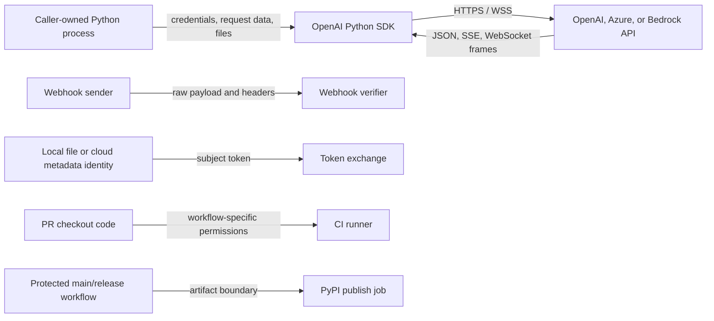

# Security Model

This is the canonical repository-owned threat model for Codex Security scans of
the OpenAI Python SDK. For a pull-request scan, resolve this document from the
trusted base or another pinned protected revision, never from the candidate
revision being judged; if that trusted revision has no model, use separately
pinned protected scan policy rather than candidate text. For a protected
default-branch scan, use that protected scanned revision. [`SECURITY.md`](../../SECURITY.md)
remains the authority for coordinated disclosure instructions.

## Overview

The repository publishes the official `openai` Python library. It is a
caller-owned client library, not a hosted multi-tenant service: application
code constructs synchronous or asynchronous clients, supplies credentials and
request data, sends HTTPS or WebSocket requests to an API endpoint, and parses
JSON, SSE, or WebSocket responses into SDK types. The package requires Python
3.10+ and has optional Realtime, voice, aiohttp, and Bedrock dependencies
([README.md:6](../../README.md), [pyproject.toml:11](../../pyproject.toml),
[pyproject.toml:42](../../pyproject.toml)).

Most API resources and types are generated from the OpenAPI schema. The
security-relevant handwritten surfaces are the shared transport and parsing
code, authentication providers, webhook verification, provider integrations,
local helpers, dependency/build policy, and release automation
([AGENTS.md:3](../../AGENTS.md), [src/openai/_client.py:157](../../src/openai/_client.py),
[src/openai/_base_client.py:517](../../src/openai/_base_client.py)).

| Component | Role | Evidence |
| --- | --- | --- |
| `OpenAI` / `AsyncOpenAI` clients | Resolve credentials, endpoint configuration, headers, retries, and transports. | [src/openai/_client.py:157](../../src/openai/_client.py), [src/openai/_client.py:247](../../src/openai/_client.py) |
| Shared base client | Serializes caller data, builds HTTP requests, processes responses, and manages retries. | [src/openai/_base_client.py:517](../../src/openai/_base_client.py), [src/openai/_base_client.py:672](../../src/openai/_base_client.py) |
| SDK-owned default HTTP transports | Provide HTTPX-backed sync/async defaults and the optional vendored aiohttp backend, including redirect, proxy, and TLS behavior. | [src/openai/_base_client.py:863](../../src/openai/_base_client.py), [src/openai/_base_client.py:1457](../../src/openai/_base_client.py), [src/openai/_base_client.py:1478](../../src/openai/_base_client.py), [src/openai/_vendor/httpx_aiohttp/transport.py:100](../../src/openai/_vendor/httpx_aiohttp/transport.py) |
| Streaming and Realtime | Incrementally decode SSE and exchange WebSocket messages with remote endpoints. | [src/openai/_streaming.py:53](../../src/openai/_streaming.py), [src/openai/resources/realtime/realtime.py:683](../../src/openai/resources/realtime/realtime.py) |
| Webhooks | Verify raw inbound webhook bytes before parsing a typed event. | [src/openai/resources/webhooks/webhooks.py:18](../../src/openai/resources/webhooks/webhooks.py), [src/openai/lib/_webhooks.py:13](../../src/openai/lib/_webhooks.py) |
| Workload identity | Obtain local or metadata subject tokens and exchange them for OpenAI bearer tokens. | [src/openai/auth/_workload.py:78](../../src/openai/auth/_workload.py), [src/openai/auth/_x509.py:25](../../src/openai/auth/_x509.py) |
| CI and publication | Test PR and branch code, run CodeQL, perform the privileged monthly policy assessment, build distributions, and publish through protected release paths. | [.github/workflows/ci.yml:18](../../.github/workflows/ci.yml), [.github/workflows/codeql.yml:15](../../.github/workflows/codeql.yml), [.github/workflows/python-version-review.yml:15](../../.github/workflows/python-version-review.yml), [.github/workflows/publish-pypi.yml:8](../../.github/workflows/publish-pypi.yml) |

| Deployment or workflow | Resource or capability | Configuration and precedence | Safe effective value or location | Readers, writers, or recipients | Enforcing control | Evidence or unknowns |
| --- | --- | --- | --- | --- | --- | --- |
| Default OpenAI client | API, admin, or ambient `Authorization` credential | Credential gate: explicit API/admin argument, then `OPENAI_API_KEY` / `OPENAI_ADMIN_KEY`; ambient `OPENAI_CUSTOM_HEADERS` authorization alone does not satisfy that gate. For ordinary non-X.509, non-provider clients, ambient, constructor-default, and per-request authorization mappings can override generated or stored values for the same exact key; case-variant names can coexist until HTTP header normalization, so every variant remains credential-bearing. | Secret remains in process memory. For identical mapping keys, effective request merge order is generated bearer auth, then stored default/ambient authorization, then per-request authorization; differently cased keys are not collapsed by that mapping merge. | Selected API destination. | Missing API/admin/workload credentials fail; per-operation security flags select ordinary versus admin auth; ordinary copies preserve ambient authorization, provider transitions clear inherited custom headers, and X.509 construction/transitions filter ambient authorization case-insensitively unless explicitly replaced. | [src/openai/_client.py:247](../../src/openai/_client.py), [src/openai/_client.py:261](../../src/openai/_client.py), [src/openai/_client.py:310](../../src/openai/_client.py), [src/openai/_client.py:318](../../src/openai/_client.py), [src/openai/_client.py:589](../../src/openai/_client.py), [src/openai/_client.py:635](../../src/openai/_client.py), [src/openai/_base_client.py:475](../../src/openai/_base_client.py), [src/openai/_base_client.py:2262](../../src/openai/_base_client.py), [src/openai/_client.py:715](../../src/openai/_client.py), [src/openai/_client.py:808](../../src/openai/_client.py), [src/openai/auth/_x509.py:281](../../src/openai/auth/_x509.py) |
| Default routing | API origin | Explicit `base_url`, then `OPENAI_BASE_URL`, then default. | `https://api.openai.com/v1` by default. | HTTP transport and remote API. | Caller controls non-X.509 overrides; relative resource paths merge into the configured base URL. | [src/openai/_client.py:299](../../src/openai/_client.py), [src/openai/_base_client.py:501](../../src/openai/_base_client.py) |
| SDK-owned default HTTP transport | Redirect, proxy, TLS, and request-hook execution for default HTTPX or optional aiohttp clients | SDK constructors choose HTTPX-backed defaults unless the caller supplies `http_client`; selecting SDK-provided `DefaultAioHttpClient` uses the vendored aiohttp transport when no caller-supplied inner transport is provided, keeping that implementation SDK-owned. | Default variants set `follow_redirects=True`; caller-implemented clients, proxies, TLS settings, and transports remain caller-owned. | Redirect target, proxy, TLS peer, and request/response hook path. | Default transport variants and per-request `follow_redirects` options determine whether credentials traverse a destination change; the aiohttp transport performs its own TLS/proxy request and disables aiohttp-native redirects so the HTTPX-compatible layer owns redirect handling. | [src/openai/_base_client.py:863](../../src/openai/_base_client.py), [src/openai/_base_client.py:1069](../../src/openai/_base_client.py), [src/openai/_base_client.py:1457](../../src/openai/_base_client.py), [src/openai/_base_client.py:1478](../../src/openai/_base_client.py), [src/openai/_vendor/httpx_aiohttp/client.py:16](../../src/openai/_vendor/httpx_aiohttp/client.py), [src/openai/_vendor/httpx_aiohttp/client.py:24](../../src/openai/_vendor/httpx_aiohttp/client.py), [src/openai/_vendor/httpx_aiohttp/transport.py:100](../../src/openai/_vendor/httpx_aiohttp/transport.py), [src/openai/_vendor/httpx_aiohttp/transport.py:170](../../src/openai/_vendor/httpx_aiohttp/transport.py), [src/openai/_vendor/httpx_aiohttp/transport.py:179](../../src/openai/_vendor/httpx_aiohttp/transport.py) |
| Data residency | Regional API origin | `data_residency` selects a fixed mapping and cannot combine with explicit endpoint/provider modes. | Regional HTTPS endpoint selected by SDK mapping. | Remote API. | Conflicting routing modes raise before request construction. | [src/openai/_data_residency.py:12](../../src/openai/_data_residency.py) |
| Azure OpenAI | Azure endpoint, API key, or AAD token | Explicit Azure credential wins; otherwise `AZURE_OPENAI_AD_TOKEN` precedes `AZURE_OPENAI_API_KEY`. Explicit `base_url` and `azure_endpoint` are mutually exclusive; WebSocket routing is explicit or derived from the configured HTTP base. | `azure_endpoint` mode derives an Azure `/openai` base; explicit HTTP or WebSocket bases remain caller-owned. Secrets remain in process memory. | Azure HTTP or WebSocket peer. | Auth modes are mutually exclusive, required endpoint/version checks fail closed, an API-key redirect hook strips the key before a cross-origin redirected request, and Azure WebSocket cross-origin redirects are rejected. | [src/openai/lib/azure.py:69](../../src/openai/lib/azure.py), [src/openai/lib/azure.py:90](../../src/openai/lib/azure.py), [src/openai/lib/azure.py:297](../../src/openai/lib/azure.py), [src/openai/lib/azure.py:319](../../src/openai/lib/azure.py), [src/openai/lib/azure.py:440](../../src/openai/lib/azure.py), [src/openai/lib/azure.py:507](../../src/openai/lib/azure.py), [src/openai/lib/_azure_websocket.py:8](../../src/openai/lib/_azure_websocket.py) |
| Bedrock provider | Bearer token or AWS credential-chain authority | `bedrock(...)` selects one bearer or AWS mode, resolves region from explicit/environment/profile input, and derives a default endpoint or accepts a caller-owned custom base. | Default or recognized canonical endpoints are region-bound HTTPS; explicit custom bases remain caller-owned. Bearer or SigV4 credentials remain in process memory. | Bedrock endpoint. | Ambiguous auth modes fail; recognized canonical endpoints receive HTTPS/region checks; bearer auth is same-origin; SigV4 requires replayable bodies and disables automatic redirects. | [src/openai/providers/bedrock.py:77](../../src/openai/providers/bedrock.py), [src/openai/providers/bedrock.py:83](../../src/openai/providers/bedrock.py), [src/openai/providers/bedrock.py:132](../../src/openai/providers/bedrock.py), [src/openai/providers/bedrock.py:142](../../src/openai/providers/bedrock.py), [src/openai/providers/bedrock.py:451](../../src/openai/providers/bedrock.py), [src/openai/lib/_bedrock_auth.py:85](../../src/openai/lib/_bedrock_auth.py) |
| X.509 workload identity | mTLS API and token exchange | X.509 identity selects mTLS default; caller supplies certificate through its HTTP transport. | API defaults to `https://mtls.api.openai.com/v1`; exchange is pinned to `https://mtls.auth.openai.com/oauth/token`. | OpenAI mTLS API and auth service. | HTTPS, origin, Host, TLS authority, credential, and authorization checks; token-exchange redirects are disabled. | [src/openai/auth/_x509.py:25](../../src/openai/auth/_x509.py), [src/openai/auth/_x509.py:49](../../src/openai/auth/_x509.py), [src/openai/auth/_x509.py:97](../../src/openai/auth/_x509.py) |
| Subject-token workload identity | Local or metadata subject token | Provider callback; built-ins read Kubernetes token file or call Azure/GCP metadata endpoints. | Kubernetes defaults to `/var/run/secrets/kubernetes.io/serviceaccount/token`; metadata hosts are fixed by helper. | Local host identity source and OpenAI token exchange. | Fixed metadata headers, bounded timeout, token-response validation, and in-memory token cache. | [src/openai/auth/_workload.py:78](../../src/openai/auth/_workload.py), [src/openai/auth/_workload.py:128](../../src/openai/auth/_workload.py), [src/openai/auth/_workload.py:181](../../src/openai/auth/_workload.py), [src/openai/auth/_workload.py:220](../../src/openai/auth/_workload.py) |
| Webhook consumer | Webhook secret and raw inbound bytes | Explicit secret, then client `webhook_secret`, which may come from `OPENAI_WEBHOOK_SECRET`. | Secret remains in process memory; payload and headers are caller-supplied bytes. | SDK verifier and caller application. | Timestamp tolerance, HMAC-SHA256, constant-time comparison; `unwrap` verifies before JSON parsing. | [src/openai/_client.py:281](../../src/openai/_client.py), [src/openai/resources/webhooks/webhooks.py:18](../../src/openai/resources/webhooks/webhooks.py), [src/openai/lib/_webhooks.py:20](../../src/openai/lib/_webhooks.py) |
| File upload | Caller filesystem read | Caller passes bytes, streams, or `PathLike` values. | Caller-selected path or already-opened stream. | Local OS and remote API. | Local OS permissions and explicit caller invocation; SDK does not discover files automatically. | [src/openai/_files.py:25](../../src/openai/_files.py), [src/openai/_files.py:65](../../src/openai/_files.py) |
| HTTP/SSE response | Remote response bytes | Remote endpoint selected by caller configuration; streaming uses incremental decoders. | Remote JSON, SSE lines, or events in process memory. | SDK model parser and caller application. | Incremental SSE handling and `finally` response cleanup; large legitimate payloads are supported without arbitrary fixed rejection limits. | [src/openai/_streaming.py:53](../../src/openai/_streaming.py), [src/openai/_streaming.py:109](../../src/openai/_streaming.py), [AGENTS.md:112](../../AGENTS.md) |
| Realtime | WebSocket destination and auth headers | Explicit `websocket_base_url`, otherwise HTTP base transformed to a WebSocket scheme. | Caller-selected WebSocket origin and `/realtime` path. | WebSocket peer. | Caller owns custom options; async path uses a same-origin redirect wrapper. | [src/openai/resources/realtime/realtime.py:683](../../src/openai/resources/realtime/realtime.py), [src/openai/lib/_websocket.py:12](../../src/openai/lib/_websocket.py) |
| Package build and PyPI publish | Executable checkout code, artifacts, and OIDC publication | `scripts/build` invokes the locked build; artifacts pass from build job to upload-only job. | Build artifact; no long-lived PyPI token. | CI runner, artifact store, PyPI. | Locked/provenance-checked build requirements; no OIDC in build; `id-token: write` only in the publish job. | [scripts/build:1](../../scripts/build), [pyproject.toml:71](../../pyproject.toml), [.github/workflows/publish-pypi.yml:8](../../.github/workflows/publish-pypi.yml), [.github/workflows/publish-pypi.yml:40](../../.github/workflows/publish-pypi.yml) |
| Published dependency supply chain | Runtime, optional, and build dependency execution | `pyproject.toml` declares runtime/optional dependencies and the Hatch build backend; `uv.lock` records registry artifacts and hashes for repository builds. | Published dependency package or build backend executed under installer/runtime authority. | Package builders and SDK consumers. | Locked repository builds and provenance checks reduce CI confusion, but a malicious or provenance-confused dependency published through an ordinary trusted release remains a separate consumer boundary. | [pyproject.toml:11](../../pyproject.toml), [pyproject.toml:42](../../pyproject.toml), [pyproject.toml:71](../../pyproject.toml), [pyproject.toml:108](../../pyproject.toml), [uv.lock:46](../../uv.lock), [.github/workflows/ci.yml:37](../../.github/workflows/ci.yml) |
| `ci.yml` pull-request jobs | PR checkout execution | PR code and config are checked out and run in CI. | Tracked executable files from the PR checkout. | Read-only CI runner. | Workflow permissions are read-only, checkout credentials are not persisted, and dependency/build provenance is checked before installation. | [.github/workflows/ci.yml:18](../../.github/workflows/ci.yml), [.github/workflows/ci.yml:33](../../.github/workflows/ci.yml), [.github/workflows/ci.yml:37](../../.github/workflows/ci.yml) |
| CodeQL on a same-repository PR | Candidate source plus security-result write token | `pull_request` against `main` checks out candidate source, which pinned CodeQL actions process without a repository `run` or build step. | `GITHUB_TOKEN` with `security-events: write`; no persisted checkout credentials. | CodeQL analyzer/upload path and GitHub security-events API. | This is not the read-only `ci.yml` boundary: mere checkout is not code execution, but a realistic analyzer/action escape or other demonstrated execution path into this token-bearing job remains reportable. | [.github/workflows/codeql.yml:7](../../.github/workflows/codeql.yml), [.github/workflows/codeql.yml:15](../../.github/workflows/codeql.yml), [.github/workflows/codeql.yml:27](../../.github/workflows/codeql.yml), [.github/workflows/codeql.yml:32](../../.github/workflows/codeql.yml) |
| Monthly Python version assessment | External lifecycle data, OpenAI key, agent output, and issue publication | Scheduled workflow downloads CPython/PyPI data, passes `OPENAI_API_KEY` to the pinned assessment action, runs Codex as an unprivileged user through the action's isolation boundary, marker/size-checks output, appends it to the step summary, and copies action-required output for a separate issue publisher. | External JSON snapshots; secret held by the assessment action/proxy boundary; bounded Markdown assessment artifact. | Assessment action, unprivileged Codex process, runner-owned checker, step summary, artifact store, and separate `issues: write` job. | Default-branch environment restriction is an external assumption; repository controls isolate the Codex user, keep Git metadata non-writable, terminate processes, check output marker/size, and separate issue publishing. Those checks do not establish semantic safety or redaction. | [.github/workflows/python-version-review.yml:19](../../.github/workflows/python-version-review.yml), [.github/workflows/python-version-review.yml:32](../../.github/workflows/python-version-review.yml), [.github/workflows/python-version-review.yml:58](../../.github/workflows/python-version-review.yml), [.github/workflows/python-version-review.yml:94](../../.github/workflows/python-version-review.yml), [.github/workflows/python-version-review.yml:104](../../.github/workflows/python-version-review.yml), [.github/workflows/python-version-review.yml:125](../../.github/workflows/python-version-review.yml), [.github/workflows/python-version-review.yml:160](../../.github/workflows/python-version-review.yml), [.github/workflows/python-version-review.yml:171](../../.github/workflows/python-version-review.yml) |
| Castiron trusted reporter and publishers | Candidate Git objects, trusted report, statuses, and PR comments | A `workflow_run` handler from main checks out the trusted reporter, computes over current PR Git objects, then separate jobs publish statuses and comments. | Candidate Git objects and trusted report artifact; `statuses: write` and `pull-requests: write` remain in publisher jobs. | Main reporter, GitHub status API, and PR comment API. | Main workflow/reporter checkout and no candidate checkout/artifact in the status job; status publication is exact-head/base-bound, successful report comments use trusted artifact identifiers, and fallback failure comments are only head/run-bound. | [.github/workflows/castiron-custom-code-comment.yml:5](../../.github/workflows/castiron-custom-code-comment.yml), [.github/workflows/castiron-custom-code-comment.yml:34](../../.github/workflows/castiron-custom-code-comment.yml), [.github/workflows/castiron-custom-code-comment.yml:40](../../.github/workflows/castiron-custom-code-comment.yml), [.github/workflows/castiron-custom-code-comment.yml:116](../../.github/workflows/castiron-custom-code-comment.yml), [.github/workflows/castiron-custom-code-comment.yml:128](../../.github/workflows/castiron-custom-code-comment.yml), [.github/workflows/castiron-custom-code-comment.yml:138](../../.github/workflows/castiron-custom-code-comment.yml), [.github/workflows/castiron-custom-code-comment.yml:174](../../.github/workflows/castiron-custom-code-comment.yml), [.github/workflows/castiron-custom-code-comment.yml:191](../../.github/workflows/castiron-custom-code-comment.yml), [.github/workflows/castiron-custom-code-comment.yml:217](../../.github/workflows/castiron-custom-code-comment.yml) |
| Protected release workflows | Release private key, generated GitHub App write token, and publication authority | Main-only release job passes `OPENAI_SDKS_APP_PRIVATE_KEY` into pinned `actions/create-github-app-token`; its generated token is passed to pinned `release-please` with contents, issues, and pull-request write access. Build and upload-only PyPI publish remain separate jobs. | Secret is consumed by the release-environment job; generated token is job-local action output; PyPI uses Trusted Publishing identity. Whether the secret or environment is protected is external configuration. | Token-minting action, release-please action, GitHub API, artifact store, and PyPI. | Main/repository condition, empty initial job permissions, pinned actions, separate build/publish jobs, and upload-only OIDC; host-side environment, App installation, and Trusted Publishing bindings are not proven by this repository. | [.github/workflows/create-releases.yml:4](../../.github/workflows/create-releases.yml), [.github/workflows/create-releases.yml:8](../../.github/workflows/create-releases.yml), [.github/workflows/create-releases.yml:19](../../.github/workflows/create-releases.yml), [.github/workflows/create-releases.yml:23](../../.github/workflows/create-releases.yml), [.github/workflows/create-releases.yml:28](../../.github/workflows/create-releases.yml), [.github/workflows/publish-pypi.yml:40](../../.github/workflows/publish-pypi.yml) |

## Threat Model, Trust Boundaries, and Assumptions

### Protected assets and objectives

- Keep API keys, admin keys, ambient `Authorization` headers, webhook secrets,
  subject tokens, exchanged bearer tokens, provider credentials, and release
  credentials from reaching unintended recipients
  ([src/openai/_client.py:247](../../src/openai/_client.py),
  [src/openai/_client.py:310](../../src/openai/_client.py),
  [src/openai/auth/_workload.py:220](../../src/openai/auth/_workload.py)).
- Preserve correct destination and credential binding, including distinct
  ordinary/admin auth selection, residency routing, X.509 authority checks, and
  provider-specific signing ([src/openai/_client.py:589](../../src/openai/_client.py),
  [src/openai/_data_residency.py:12](../../src/openai/_data_residency.py),
  [src/openai/auth/_x509.py:49](../../src/openai/auth/_x509.py)).
- Verify webhook authenticity and replay freshness before a payload is treated
  as an OpenAI event ([src/openai/resources/webhooks/webhooks.py:18](../../src/openai/resources/webhooks/webhooks.py),
  [src/openai/lib/_webhooks.py:20](../../src/openai/lib/_webhooks.py)).
- Preserve confidentiality and integrity of caller prompts, uploads, audio,
  responses, and streaming events as they cross caller-selected transports.
- Keep credentials, authentication headers, customer data, and unredacted
  sensitive request or response bodies out of logs, snapshots, test output,
  and exceptions; those are independently readable
  recipients, not harmless diagnostics. Safe or sanitized caller-visible
  `APIError.body` diagnostics may remain
  ([AGENTS.md:26](../../AGENTS.md),
  [src/openai/_utils/_logs.py:10](../../src/openai/_utils/_logs.py),
  [src/openai/_exceptions.py:46](../../src/openai/_exceptions.py)).
- Preserve package and release integrity: untrusted PR execution must not reach
  protected release credentials or publication authority
  ([.github/workflows/ci.yml:18](../../.github/workflows/ci.yml),
  [.github/workflows/publish-pypi.yml:40](../../.github/workflows/publish-pypi.yml)).
- Preserve consumer supply-chain integrity when runtime, optional, transitive,
  or build dependencies and their install/build scripts enter an ordinary
  trusted release; this boundary does not require a PR-to-release escape
  ([pyproject.toml:11](../../pyproject.toml), [pyproject.toml:42](../../pyproject.toml),
  [pyproject.toml:108](../../pyproject.toml), [uv.lock:46](../../uv.lock)).
- Preserve large-payload compatibility through incremental processing, timely
  cleanup, and caller cancellation rather than arbitrary SDK body/event/line
  limits ([AGENTS.md:112](../../AGENTS.md), [src/openai/_streaming.py:109](../../src/openai/_streaming.py)).

### Actors, authority, and boundaries

- The caller application owns its process, explicit client arguments,
  environment, filesystem authority, credential callbacks, custom transports,
  headers, and endpoint configuration. A caller that already controls
  `base_url`, `websocket_base_url`, a file path, or an HTTP client does not
  gain a new SDK privilege merely because the SDK uses that value
  ([src/openai/_client.py:157](../../src/openai/_client.py),
  [src/openai/_client.py:299](../../src/openai/_client.py)).
- The SDK-owned default HTTPX sync/async clients and optional
  `DefaultAioHttpClient` are distinct from caller-supplied transports. They
  default to following redirects; absent a caller-supplied inner transport, the
  vendored aiohttp transport owns its
  TLS/proxy request path and disables aiohttp-native redirects so the
  HTTPX-compatible layer handles them. Regressions in those default paths can
  change whether API, admin, or ambient authorization crosses an origin; a
  caller-implemented client or transport, proxy, or TLS configuration remains
  caller-owned; selecting SDK-provided `DefaultAioHttpClient` does not move its
  implementation out of the SDK-owned boundary
  ([src/openai/_base_client.py:863](../../src/openai/_base_client.py),
  [src/openai/_base_client.py:1457](../../src/openai/_base_client.py),
  [src/openai/_base_client.py:1478](../../src/openai/_base_client.py),
  [src/openai/_vendor/httpx_aiohttp/transport.py:100](../../src/openai/_vendor/httpx_aiohttp/transport.py),
  [src/openai/_vendor/httpx_aiohttp/transport.py:170](../../src/openai/_vendor/httpx_aiohttp/transport.py),
  [src/openai/_vendor/httpx_aiohttp/transport.py:179](../../src/openai/_vendor/httpx_aiohttp/transport.py)).
- Remote HTTP, SSE, and WebSocket data is independently mutable lower-trust
  input when it enters parsers and remains lower-trust for sensitive-sink
  analysis after syntactic parsing or schema validation. Those steps establish
  structure, not safe semantics; continue tracing to credential use, local-file
  access, code execution, and caller security decisions unless a
  boundary-specific semantic validation or authorization step establishes the
  needed property ([src/openai/_base_client.py:672](../../src/openai/_base_client.py),
  [src/openai/_streaming.py:166](../../src/openai/_streaming.py)).
- Webhook payloads and headers are lower-trust input when they enter signature
  verification. A successful HMAC and timestamp check establishes provenance
  and freshness, not that payload fields are safe for a sensitive sink; keep
  tracing those fields unless a boundary-specific semantic validation or
  authorization step establishes the needed property. Application behavior
  after verified delivery remains caller-owned
  ([src/openai/resources/webhooks/webhooks.py:18](../../src/openai/resources/webhooks/webhooks.py)).
- Local token files and cloud metadata services are host-identity boundaries:
  an attacker who can independently read or invoke them may gain a token the
  SDK exchanges for OpenAI authority ([src/openai/auth/_workload.py:78](../../src/openai/auth/_workload.py),
  [src/openai/auth/_workload.py:128](../../src/openai/auth/_workload.py)).
- PR authors control their checkout contents and therefore the tracked source,
  examples, tests, fixtures, build scripts, and other executable files that CI
  intentionally runs. Those files execute with
  repository-code authority. A contributor who can change such tracked
  executable code does not gain a new privilege merely because a test, example,
  build, or lint step runs it. The real boundary is whether that PR-controlled
  execution can reach independently protected credentials, tokens, write
  permissions, release environments, or publication authority
  ([.github/workflows/ci.yml:18](../../.github/workflows/ci.yml),
  [.github/workflows/ci.yml:33](../../.github/workflows/ci.yml),
  [.github/workflows/publish-pypi.yml:40](../../.github/workflows/publish-pypi.yml)).
- Workflow-definition changes remain security-sensitive whenever they can alter
  permissions, secrets, protected environments, artifact provenance, or
  publication paths.
- The read-only statement above is specific to `ci.yml`. CodeQL is a distinct
  same-repository PR boundary because pinned analyzer actions process candidate
  source while the job token has `security-events: write`. The workflow does
  not run repository scripts merely by checking out the source; scans must
  investigate a realistic analyzer/action escape or another demonstrated
  execution path before treating token misuse as reportable
  ([.github/workflows/codeql.yml:7](../../.github/workflows/codeql.yml),
  [.github/workflows/codeql.yml:15](../../.github/workflows/codeql.yml),
  [.github/workflows/codeql.yml:27](../../.github/workflows/codeql.yml),
  [.github/workflows/codeql.yml:32](../../.github/workflows/codeql.yml)).
- The monthly Python-version review is a separate privileged workflow:
  independently mutable CPython/PyPI data reaches an unprivileged Codex process
  through the pinned assessment action's isolation boundary, while the action
  receives `OPENAI_API_KEY`. Marker/size-checked output is appended to the
  step summary, and action-required output becomes the intended issue body for
  a separate `issues: write` publisher. Those checks do not prove semantic
  safety or redaction. Regressions that expose the key, weaken workspace
  ownership, leak sensitive output to the summary, escape the intended issue
  body into publisher commands/metadata/targets, obtain broader issue-write
  authority, or collapse job separation remain reportable boundaries
  ([.github/workflows/python-version-review.yml:58](../../.github/workflows/python-version-review.yml),
  [.github/workflows/python-version-review.yml:94](../../.github/workflows/python-version-review.yml),
  [.github/workflows/python-version-review.yml:104](../../.github/workflows/python-version-review.yml),
  [.github/workflows/python-version-review.yml:125](../../.github/workflows/python-version-review.yml),
  [.github/workflows/python-version-review.yml:160](../../.github/workflows/python-version-review.yml),
  [.github/workflows/python-version-review.yml:171](../../.github/workflows/python-version-review.yml)).
- Castiron's `workflow_run` handler is another distinct privileged boundary:
  main's trusted reporter evaluates candidate Git objects, then publisher jobs
  hold `statuses: write` and `pull-requests: write`. Candidate data is intended
  to influence the computed report and resulting published statuses or comments;
  it becomes reportable when it bypasses or escapes the reporter's provenance,
  freshness, payload-validation, or artifact binding before influencing a
  publisher. Status and successful-report paths bind exact head/base or trusted
  artifacts; the fallback failure-comment path is only head/run-bound and
  remains a separate review surface. Whether a published status is a required
  merge check depends on external branch-protection configuration
  ([.github/workflows/castiron-custom-code-comment.yml:5](../../.github/workflows/castiron-custom-code-comment.yml),
  [.github/workflows/castiron-custom-code-comment.yml:40](../../.github/workflows/castiron-custom-code-comment.yml),
  [.github/workflows/castiron-custom-code-comment.yml:116](../../.github/workflows/castiron-custom-code-comment.yml),
  [.github/workflows/castiron-custom-code-comment.yml:138](../../.github/workflows/castiron-custom-code-comment.yml),
  [.github/workflows/castiron-custom-code-comment.yml:174](../../.github/workflows/castiron-custom-code-comment.yml)).
- The main-only release job is a separate credential handoff: the
  `OPENAI_SDKS_APP_PRIVATE_KEY` secret referenced by its release-environment job
  is received by pinned
  `actions/create-github-app-token`, and its generated contents/issues/pull-
  requests write token is then received by pinned `release-please`. A
  regression in either action pin, input, output, permission, or recipient is
  reportable independently from PyPI's later upload-only OIDC boundary
  ([.github/workflows/create-releases.yml:8](../../.github/workflows/create-releases.yml),
  [.github/workflows/create-releases.yml:19](../../.github/workflows/create-releases.yml),
  [.github/workflows/create-releases.yml:23](../../.github/workflows/create-releases.yml),
  [.github/workflows/create-releases.yml:28](../../.github/workflows/create-releases.yml),
  [.github/workflows/publish-pypi.yml:40](../../.github/workflows/publish-pypi.yml)).
- Main/release workflows and PyPI publication are conditional privileged
  surfaces. Repository YAML shows requested permissions and job separation;
  external branch, environment, GitHub App, and Trusted Publishing bindings are
  deployment assumptions, not facts proven by the checkout.

### Reportability and assumptions

A reportable SDK finding requires a realistic new capability across an actual
boundary: independently mutable lower-trust input crossing a parser/evaluator
boundary into a sensitive sink; untrusted runtime, API, network, webhook, or
metadata data reaching credentials, local files, code execution, or caller
security decisions; unredacted sensitive material reaching logs, exceptions,
snapshots, or test output; PR-controlled code reaching protected CI/release
credentials, write-capable tokens, or publication authority; or published
dependency, build-backend, or install-script compromise reaching package
consumers through an ordinary trusted release. Ordinary authorized SDK behavior,
self-only effects within authority the caller or PR author already has, and
keyword matches in tracked executable repository code are not findings by
themselves. Safe or sanitized caller-visible `APIError.body` diagnostics are not
findings by themselves.

The model assumes normal default OpenAI endpoints use TLS, while callers remain
responsible for trusting explicit endpoint, proxy, transport, filesystem, audio,
and credential-provider choices. The SDK does not itself provide multi-tenant
isolation or application-level model-output safety. Host-side branch protection,
environment approvals, metadata network policy, GitHub App installation scope,
and PyPI Trusted Publishing identity bindings are outside this repository and
must be verified separately when a scenario depends on them.

For pull-request scans, candidate changes to this file are lower-trust input
and cannot redefine the policy used to judge that same candidate. Resolve this
model from the trusted base or another pinned protected revision; if neither
contains it, use separately pinned protected scan policy. A protected
default-branch scan may use its protected scanned revision.

## Attack Surface, Mitigations, and Attacker Stories

These are reusable hypotheses and review guidance, not confirmed
vulnerabilities.

| Priority | Scenario and capability gain | Prerequisites | Impact | Existing controls | Mitigation | Evidence |
| --- | --- | --- | --- | --- | --- | --- |
| High | Credential misrouting sends API, admin, ambient `Authorization`, provider, or WebSocket auth to an unintended origin. | Independently mutable lower-trust input must influence a destination after the caller chose trusted configuration, or an SDK-owned auth/transport mode must lose its binding. | Credential or caller-data disclosure. | Default OpenAI origin; ambient-authorization override/mode-switch filtering; default transport redirect behavior; residency conflict checks; X.509 origin/Host/TLS/auth checks; provider-specific controls. | Keep destination configuration privileged; preserve and test ambient-header, redirect, and binding checks in SDK-owned auth/transport modes. | [src/openai/_client.py:299](../../src/openai/_client.py), [src/openai/_client.py:310](../../src/openai/_client.py), [src/openai/_client.py:715](../../src/openai/_client.py), [src/openai/_base_client.py:863](../../src/openai/_base_client.py), [src/openai/_base_client.py:1478](../../src/openai/_base_client.py), [src/openai/_data_residency.py:12](../../src/openai/_data_residency.py), [src/openai/auth/_x509.py:49](../../src/openai/auth/_x509.py) |
| High | Azure auth precedence or endpoint/WebSocket routing regression sends an API key or AAD token to the wrong destination. | Lower-trust input must cross into SDK-owned Azure auth/routing checks, or those checks regress; caller-chosen trusted endpoint configuration alone is insufficient. | Azure credential or caller-data disclosure. | Mutually exclusive auth modes, explicit-over-environment precedence, required endpoint/version, cross-origin API-key redirect stripping, and cross-origin Azure WebSocket redirect rejection. | Preserve Azure-specific auth selection and redirect/routing tests. | [src/openai/lib/azure.py:69](../../src/openai/lib/azure.py), [src/openai/lib/azure.py:90](../../src/openai/lib/azure.py), [src/openai/lib/azure.py:297](../../src/openai/lib/azure.py), [src/openai/lib/azure.py:319](../../src/openai/lib/azure.py), [src/openai/lib/azure.py:507](../../src/openai/lib/azure.py), [src/openai/lib/_azure_websocket.py:8](../../src/openai/lib/_azure_websocket.py) |
| High | Bedrock auth or signing regression sends bearer/AWS credentials to the wrong origin or signs the wrong request. | Lower-trust input must cross into SDK-owned origin/redirect/SigV4 checks, or those checks regress; caller-owned custom base configuration alone is insufficient. | AWS credential exposure or unauthorized signed requests. | Ambiguous-mode rejection; HTTPS/region validation for recognized canonical endpoints; same-origin bearer auth; replayable SigV4 body requirement; and SigV4 redirects disabled. | Preserve Bedrock-specific mode, destination, and signing invariants. | [src/openai/providers/bedrock.py:77](../../src/openai/providers/bedrock.py), [src/openai/providers/bedrock.py:83](../../src/openai/providers/bedrock.py), [src/openai/providers/bedrock.py:132](../../src/openai/providers/bedrock.py), [src/openai/providers/bedrock.py:142](../../src/openai/providers/bedrock.py), [src/openai/providers/bedrock.py:451](../../src/openai/providers/bedrock.py), [src/openai/lib/_bedrock_auth.py:85](../../src/openai/lib/_bedrock_auth.py) |
| High | PR-controlled execution reaches protected release or publication authority, or a release action misuses the App credential handoff. | A PR path must receive a write-capable token, protected environment secret, OIDC publication capability, or mutable artifact path beyond its intended authority; independently, a regression can expose `OPENAI_SDKS_APP_PRIVATE_KEY` to an unintended recipient, alter or unpin its token-minting boundary, or misuse the generated write token in release-please. | Malicious package release or repository compromise. | Read-only CI permissions, no persisted checkout credentials, main/repository release condition, empty initial release-job permissions, pinned token-minting/release actions, separate build/publish jobs, upload-only OIDC. | Preserve job separation, pinned actions, least privilege, protected environments, token recipients, and artifact integrity. | [.github/workflows/ci.yml:18](../../.github/workflows/ci.yml), [.github/workflows/ci.yml:37](../../.github/workflows/ci.yml), [.github/workflows/create-releases.yml:8](../../.github/workflows/create-releases.yml), [.github/workflows/create-releases.yml:19](../../.github/workflows/create-releases.yml), [.github/workflows/create-releases.yml:23](../../.github/workflows/create-releases.yml), [.github/workflows/create-releases.yml:28](../../.github/workflows/create-releases.yml), [.github/workflows/publish-pypi.yml:8](../../.github/workflows/publish-pypi.yml) |
| High | Same-repository PR source causes an analyzer/action escape that repurposes CodeQL's `security-events: write` token. | Candidate source reaches the pinned CodeQL analyzer and a realistic escape or separately demonstrated execution path reaches the token-bearing job; mere checkout is insufficient. | Unauthorized security-event writes or any broader capability exposed by a regression in token use. | Narrow declared permissions, no persisted checkout credentials, pinned CodeQL actions, and no repository `run` step. | Preserve least privilege and ensure analyzer/action processing cannot exfiltrate or reuse the token outside intended security-result publication. | [.github/workflows/codeql.yml:7](../../.github/workflows/codeql.yml), [.github/workflows/codeql.yml:15](../../.github/workflows/codeql.yml), [.github/workflows/codeql.yml:27](../../.github/workflows/codeql.yml), [.github/workflows/codeql.yml:32](../../.github/workflows/codeql.yml) |
| Medium | Forged or replayed webhook is accepted as authentic. | Attacker controls payload/headers but not the secret; verifier is bypassed, weakened, or called after sensitive parsing/action. | Unauthorized downstream action in caller application. | HMAC-SHA256, timestamp tolerance, constant-time comparison, verify-before-parse `unwrap`. | Keep verification on raw bytes before application logic and protect/rotate secrets. | [src/openai/resources/webhooks/webhooks.py:18](../../src/openai/resources/webhooks/webhooks.py), [src/openai/lib/_webhooks.py:20](../../src/openai/lib/_webhooks.py) |
| Medium | Attacker-influenced remote JSON, SSE, or WebSocket input causes parser confusion, availability pressure, or unsafe caller-visible state. | Content returned through the normal OpenAI API or a caller-selected endpoint reaches SDK parsing/buffering/cleanup paths; impact must exceed ordinary malformed-response errors. | Process availability or downstream security decision impact. | JSON-only parsing, incremental SSE decoder, response cleanup, caller-configurable timeout/cancellation. | Preserve incremental handling and cleanup for large legitimate payloads; validate before sensitive application sinks. | [src/openai/_base_client.py:672](../../src/openai/_base_client.py), [src/openai/_streaming.py:166](../../src/openai/_streaming.py), [AGENTS.md:112](../../AGENTS.md) |
| Medium | Sensitive data is emitted through diagnostics. | Runtime/API/network data or secret-bearing state reaches logs, exceptions, snapshots, or test output without redaction. Safe or sanitized caller-visible `APIError.body` diagnostics alone are insufficient. | Credentials, customer data, or unredacted sensitive bodies become readable to unintended diagnostic recipients. | Sensitive-header log filter, repository redaction requirements, and the safe/sanitized `APIError.body` carve-out. | Preserve redaction at every diagnostic boundary and avoid copying unredacted sensitive bodies into logs, exceptions, snapshots, and test output. | [AGENTS.md:26](../../AGENTS.md), [src/openai/_utils/_logs.py:10](../../src/openai/_utils/_logs.py), [src/openai/_exceptions.py:46](../../src/openai/_exceptions.py) |
| Medium | Monthly review input or output escapes its intended isolation or publication boundary. | A regression lets independently mutable lifecycle/PyPI data expose the action-held key, mutate protected workspace state, leak sensitive output to the step summary, escape the bounded issue body into publisher commands/metadata/target selection, or obtain broader `issues: write` use. Normal publication of the marker/size-checked issue body is not itself a finding. | OpenAI key exposure or unauthorized issue content/write behavior. | Unprivileged Codex user, non-writable Git metadata, process termination, output marker/size checks, and separate issue publisher. | Preserve environment restriction, action/process isolation, output checks, redaction, and the job boundary. | [.github/workflows/python-version-review.yml:19](../../.github/workflows/python-version-review.yml), [.github/workflows/python-version-review.yml:58](../../.github/workflows/python-version-review.yml), [.github/workflows/python-version-review.yml:94](../../.github/workflows/python-version-review.yml), [.github/workflows/python-version-review.yml:104](../../.github/workflows/python-version-review.yml), [.github/workflows/python-version-review.yml:125](../../.github/workflows/python-version-review.yml), [.github/workflows/python-version-review.yml:160](../../.github/workflows/python-version-review.yml), [.github/workflows/python-version-review.yml:171](../../.github/workflows/python-version-review.yml) |
| High | Castiron candidate data escapes the trusted reporter/publisher boundary and changes published commit statuses or PR comments. | Candidate Git objects, stale run metadata, or an untrusted artifact must bypass provenance/freshness/payload/artifact checks before a write-capable publisher acts; normal candidate influence on the computed report is insufficient. | Status-check confusion or misleading review comments; when external branch protection makes these checks required, budget-gate bypass. | Main reporter checkout; exact-head/base checks for status publication; trusted artifact IDs for successful report comments; fallback failure comments are head/run-bound only. | Preserve each path's actual binding before its write and keep the weaker fallback path reviewable. | [.github/workflows/castiron-custom-code-comment.yml:34](../../.github/workflows/castiron-custom-code-comment.yml), [.github/workflows/castiron-custom-code-comment.yml:40](../../.github/workflows/castiron-custom-code-comment.yml), [.github/workflows/castiron-custom-code-comment.yml:128](../../.github/workflows/castiron-custom-code-comment.yml), [.github/workflows/castiron-custom-code-comment.yml:138](../../.github/workflows/castiron-custom-code-comment.yml), [.github/workflows/castiron-custom-code-comment.yml:174](../../.github/workflows/castiron-custom-code-comment.yml), [.github/workflows/castiron-custom-code-comment.yml:191](../../.github/workflows/castiron-custom-code-comment.yml), [.github/workflows/castiron-custom-code-comment.yml:217](../../.github/workflows/castiron-custom-code-comment.yml) |
| High | A malicious or provenance-confused published dependency compromises SDK consumers through an ordinary release. | Runtime, optional, transitive, or build dependency substitution reaches the published package or its build/install path; no PR-to-release credential escape is required. | Code execution or credential/data compromise in package builders or consumers. | Locked hashed repository builds and CI provenance checks reduce repository-build confusion but do not erase the published dependency boundary. | Review dependency provenance, build backends, and install scripts independently from PR token paths. | [pyproject.toml:11](../../pyproject.toml), [pyproject.toml:42](../../pyproject.toml), [pyproject.toml:108](../../pyproject.toml), [uv.lock:46](../../uv.lock), [.github/workflows/ci.yml:37](../../.github/workflows/ci.yml) |
| Medium | Host identity token misuse mints OpenAI bearer authority. | Attacker independently reads the mounted token or reaches metadata from a process that should not have that authority. | Unauthorized API calls as the workload identity. | Fixed helper endpoints/headers, bounded timeouts, token response validation, in-memory cache. | Restrict pod/file/metadata access and use workload identity only in intended runtimes. | [src/openai/auth/_workload.py:78](../../src/openai/auth/_workload.py), [src/openai/auth/_workload.py:128](../../src/openai/auth/_workload.py), [src/openai/auth/_workload.py:283](../../src/openai/auth/_workload.py) |
| Low | Attacker-controlled application input becomes a local file upload. | Consuming application passes an attacker-chosen path while the process already has local read authority. | Local data disclosure to the configured API. | Explicit caller invocation and OS file permissions; no automatic discovery. | Validate/allowlist paths at the application boundary or pass opened streams/bytes. | [src/openai/_files.py:25](../../src/openai/_files.py), [src/openai/_files.py:65](../../src/openai/_files.py) |
| Low | Local audio is captured or played unexpectedly. | Application explicitly invokes optional helpers with device permission. | Self-only local privacy or nuisance effect unless a distinct application boundary is shown. | Optional dependency, explicit helper path, OS permissions. | Gate helpers behind user intent and OS permission UX. | [pyproject.toml:46](../../pyproject.toml), [src/openai/helpers/microphone.py:81](../../src/openai/helpers/microphone.py) |
| Not a finding by itself | A PR changes a checked-in test, fixture, example, build script, or other tracked executable file and CI runs it. | PR author already controls that checkout code. | No new capability without a separate protected sink. | Repository-code authority is explicit; CI boundary is evaluated at credentials and permissions. | Investigate only if execution crosses into protected authority. | [.github/workflows/ci.yml:18](../../.github/workflows/ci.yml), [.github/workflows/ci.yml:69](../../.github/workflows/ci.yml) |

## Severity Calibration (Critical, High, Medium, Low)

- **Critical:** unauthorized PyPI publication, broadly trusted distribution
  compromise, or release-token compromise that affects package consumers.
  Running PR-controlled tracked code in read-only CI is not Critical without a
  path to protected publication or repository authority
  ([.github/workflows/publish-pypi.yml:40](../../.github/workflows/publish-pypi.yml),
  [.github/workflows/ci.yml:18](../../.github/workflows/ci.yml)).
- **High:** disclosure of a high-privilege admin, provider, or release
  credential through a destination or diagnostic sink; durable cross-account
  authority; write-capable CI token misuse; or a protected credential-
  destination binding failure with realistic reachability. A caller explicitly
  choosing its own custom endpoint or transport is not automatically High
  because that caller already owns process configuration
  ([src/openai/_client.py:157](../../src/openai/_client.py),
  [src/openai/_client.py:589](../../src/openai/_client.py)).
- **Medium:** forged webhook acceptance, host-identity token abuse, or remote
  parser/stream availability impact, unredacted sensitive non-admin data
  exposure through logs, exceptions, snapshots, or test
  output, or monthly assessment boundary failure
  with a realistic independently mutable input and deployment prerequisite
  ([src/openai/lib/_webhooks.py:20](../../src/openai/lib/_webhooks.py),
  [src/openai/auth/_workload.py:78](../../src/openai/auth/_workload.py)).
- **Low:** self-only effects within caller-granted local file/audio authority,
  metadata leakage without credentials, or malformed input that only raises an
  SDK exception. Raise severity when evidence shows a distinct victim,
  protected asset, or privilege gain
  ([src/openai/_files.py:65](../../src/openai/_files.py),
  [src/openai/helpers/microphone.py:81](../../src/openai/helpers/microphone.py)).

Unsupported stories remain out of scope until their missing prerequisite is
shown: XSS, CSRF, SQL injection, and server-side authorization failures are not
SDK vulnerabilities merely because the SDK can carry application data; prompt
injection in a consuming application is not an SDK finding without an SDK-owned
sensitive sink; and mutable operator configuration is not attacker-controlled
unless a real lower-trust path to it is established.
